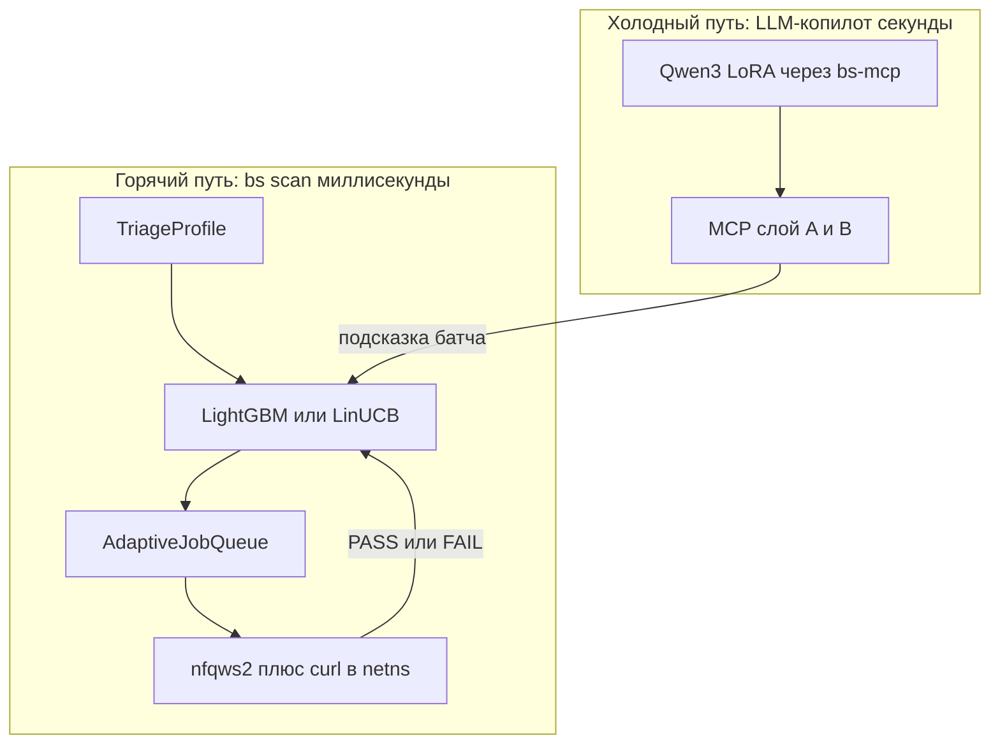

# ML/NN roadmap — blockcheckS (AQ → learned orchestrator)

> **Версия:** 1.1 · **blockcheckS:** 1.4.0+ · **Обновлено:** 2026-08-28  
> Рабочий документ: на него опираемся при датасете, ранкере, LLM-копилоте и эмуляторе DPI.  
> Sprint-чеклисты по-прежнему в [todo.md](todo.md). Этот файл — *зачем* и *как*, не дублирует открытые тикеты.

---

## Как читать этот документ

| Если вы… | Читайте |
| --- | --- |
| Хотите понять идею за 5 минут | [Простыми словами](#простыми-словами) |
| Пишете код очереди / `--ranker` | [Вариант 2](#вариант-2-маленькая-модель-вместо-линейных-весов-aq) → [Фаза 1–3A](#фаза-1--приближение-без-nn) |
| Собираете GPU VPS и дообучаете LLM | [Вариант 1](#вариант-1-llm-как-mcp-копилот) → [Стек 2026](#стек-2026-llm-unsloth-studio-qwen3) |
| Думаете про «нейросеть как Geneva» | [Наука: ML и обход DPI](#наука-ml-и-обход-dpi) — сначала generator vs ranker |
| Ищете первоисточники | [Источники](#источники-с-датами) |

**Правило истины:** модель никогда не заменяет живую пробу (`curl` / TLS в netns). Модель только говорит очереди: «попробуй это раньше». Вердикт PASS/FAIL всегда с сети.

---

## Простыми словами

blockcheckS уже умеет массово проверять стратегии nfqws2: тысячи вариантов `fake` / `split` / `tamper` × блобы × fooling, каждый тест в своём netns. Результат пишется в SQLite: PASS или FAIL.

Проблема не в том, что стратегий мало. Проблема в том, что **полный перебор дорогой**. На Fryazino (LLC Fiord) типичная картина: из каталога работает узкий паттерн (`fake:blob=…:repeats=6:tcp_ts=-1000` и близкие), остальное — timeout / SSL 35. Адаптивная очередь (AQ) уже пытается не тыкать вслепую: если `fake+stun` прошёл на `discord.com`, она поднимает вес этой семьи и похожих блобов и пробует их раньше на соседних доменах.

AQ — это **линейная эвристика** с тремя ручными коэффициентами (семья 1.0, блоб 0.5, trait 0.4) плюс ε-greedy (10% случайных проб). Она работает, но не умеет:

- учесть профиль ТСПУ из preflight (RST на SNI vs silent drop vs stall);
- отличить «этот HTTP 404 — это PASS, ТСПУ пробит» от шума Lua-bridge без APPLIED;
- сказать «на YouTube сначала fooling A, на Discord — B».

**ML здесь — не «магический обход блокировок».** Это два разных инструмента:

1. **Ранжировщик (горячий путь, миллисекунды).** По таблице «домен + triage + признаки стратегии → был ли PASS» учится ставить перспективные стратегии в начало очереди. Это классический табличный ML / контекстный бандит. Именно этим занимается наука про *выбор действия при контексте*, а не про генерацию новых пакетов.
2. **LLM-копилот (холодный путь, секунды).** Модель читает triage и вызывает MCP-инструменты (`triage_domain` → `query_strategies` → `find_working_strategy`). Это оркестрация для оператора/агента, не замена `AdaptiveJobQueue.pop()`.

Наука по обходу цензуры (Geneva, DeResistor, Amoeba) почти целиком про **генерацию новых мутаций пакетов**. У blockcheckS уже есть готовый каталог nfqws2 и ~140k размеченных проб. Наша ниша — **ранжировать каталог**, а генерировать новое — только если каталог исчерпан (фаза 4).



---

## Словарь

Термины, которые дальше встречаются без расшифровки.

| Термин | Простыми словами | У нас |
| --- | --- | --- |
| **Стратегия** | Рецепт, как nfqws2 ломает DPI: `fake:blob=stun:repeats=6:tcp_ts=-1000` | строки в `strategies` |
| **Каталог** | Конечный список таких рецептов, который генерирует MatrixGenerator | не бесконечное пространство пакетов |
| **Метка / label** | Ответ сети: PASS или FAIL (иногда THROTTLED) | `tcp_results.status` |
| **Фичи** | Числа/категории, которые модель видит: семья, блоб, домен, поля triage | `classify_strategy_family`, `TriageProfile` |
| **Ранжировщик / ranker** | Модель, которая сортирует каталог: «эта стратегия скорее PASS» | цель `--ranker` |
| **Контекстный бандит** | «Дано состояние сети — какое действие взять дальше». Один шаг, одна награда. Не шахматы | AQ уже ε-greedy бандит |
| **LinUCB / Thompson** | Два классических бандита: баланс «эксплуатировать известное» vs «попробовать новое» | апгрейд ε-greedy |
| **GBDT / LightGBM** | Лес деревьев для таблиц. Быстро на CPU, хорошо на смешанных фичах | Track A, v1 |
| **TabPFN** | «Фундаментальная» модель для таблиц: один forward pass, без долгого fit | офлайн-эксперимент, не hot path Xeon |
| **QLoRA / LoRA** | Дообучение LLM: крутим маленькие адаптеры, не все миллиарды весов | Track B |
| **SFT** | Supervised Fine-Tuning: учим на диалогах «вопрос → вызов инструмента» | MCP trajectories |
| **Оракул** | Единственный источник правды. Здесь — живая проба, не предсказание модели | netns + curl_cffi |
| **Sim-to-real** | Модель, обученная в лаборатории, часто врёт на живом ISP | фаза 4: валидация только на Fiord |
| **Recall@K** | Из стратегий, которые вообще умеют PASS на домене, какая доля попала в первые K попыток | главная метрика ранкера |
| **Generator (Geneva)** | Генетика ищет *новые* деревья действий над пакетами | не путать с нашим MatrixGenerator |

---

## Что уже есть (assets)

Датасет уже «живой». На момент составления roadmap: `week_cov.db` (~140k `tcp_results`, ~19k PASS), `data_block` провайдера `llc_trc_fiord` — порядка **31k PASS** на ~35 доменах. Этого хватает для табличного ранкера. Для 7B LLM этого **не** хватает: там нужны логи «человек/агент вызвал такие-то MCP-инструменты и получилось вот это».

| Asset | Где | Зачем модели |
| --- | --- | --- |
| Метки | `tcp_results`, `udp_results`, `pair_results` | status, fail_phase, latency, http_code |
| Признаки стратегии | `classify_strategy_family`, `extract_blob_hints`, `strategy_traits` | уже в [`adaptive_queue.py`](../src/blockchecks/engine/adaptive_queue.py) |
| Контекст сети | `TriageProfile` (40+ полей) | [`triage.py`](../src/blockchecks/engine/triage.py), таблица `triage_snapshots` |
| Провайдер | `pass_strategies`, `triage.toml`, DNS cache | [`data_block/store.py`](../src/blockchecks/data_block/store.py) |
| Positive export | `shortlist_export` schema v1 | готовые PASS для холодного старта |
| MCP | 22 инструмента | API для LLM-оркестратора |
| Очередь | ε-greedy + boost_pass + fan-out | baseline, с которым сравниваем ML |
| Метрика | recall@K в todo | скрипта пока **нет** |

AQ уже делает то, что в учебниках называют *contextual bandit*: контекст (домен, недавние PASS), действие (стратегия), награда (1/0). Линейные веса — самый простой бандит. Следующий шаг — выучить веса и/или заменить scoring на GBDT, не выкидывая fan-out и изоляцию netns.

---

## Две разные задачи — не смешивать

| | Вариант 2: ранкер | Вариант 1: LLM |
| --- | --- | --- |
| Вопрос | Какую стратегию из каталога поставить следующей? | Какие MCP-вызовы сделать для оператора? |
| Вход | таблица чисел и категорий | текст + JSON triage + список tools |
| Выход | score / приоритет в куче | последовательность tool-call |
| Латентность | < 1 мс на Xeon | секунды на GPU |
| Данные | tcp_results (уже есть) | MCP-траектории (ещё нет) |
| Где крутится | внутри `bs scan` | рядом с Cursor/opencode, через `bs-mcp` |
| Чем мерить | recall@K, jobs-to-first-pass | точность выбора tool, oracle recall@10 |

**7B LLM на горячем пути ранжирования — плохая идея:** медленно, дорого, на табличных «features → 0/1» GBDT и бандиты стабильно сильнее zero/few-shot LLM. Это не мнение, а повторяющийся результат 2023–2026 на tabular benchmarks (см. источники). LLM + GBDT вместе на чистой таблице synergy почти не дают: LLM полезен там, где есть язык и инструменты.

---

## Наука: ML и обход DPI

Коротко: академический ML почти всегда **генерирует** обход, а не **выбирает** из готового каталога zapret/nfqws2. Community-инструменты (strategy-selector, zapret-toolkit) по-прежнему брутфорсят live-пробами. blockcheckS с 140k меток и TriageProfile — ближе к *ранкеру каталога*, и этой постановки в papers почти нет. Это плюс (ниша), а не минус.

### Генераторы (не наш hot path)

| Проект | Что делает | Чего не делает | Когда нам полезен |
| --- | --- | --- | --- |
| **Geneva** (CCS 2019, UMD) | Генетический алгоритм: 4 примитива drop/duplicate/fragment/tamper → дерево мутаций пакета. Фитнес = живой цензор | Не знает nfqws2/Lua; не ранжирует каталог; не обходит IP-блок | Фаза 4: идеи пространства действий, не вендоринг |
| **GET /out** (USENIX Sec 2022) | Тот же GA, но HTTP/DNS-слой | Не TCP-desync | Референс «цензор RFC-строже сервера» |
| **DeResistor** (USENIX Sec 2023) | Обёртка над Geneva: ML-детектор *проб* на стороне цензора + паузы + перемешивание с обычным трафиком | Не ranker стратегий | Длинные кампании: DPI может ловить *сам факт скана* (у них RF ловил Geneva после ~2 flow) |
| **Amoeba** (CoNEXT 2023) | RL меняет размер/тайминг пакетов, чтобы обмануть ML-классификатор потока | Учится на прокси-классификаторе в лаборатории, не на ТСПУ | Не копировать PPO в AQ |
| **Deep PackGen** (arXiv 2023 → ACM TOPS 2025) | RL против ML-NIDS | Другой домен (IDS, не госцензор) | Тот же generator-паттерн |
| **UPGen** (USENIX Sec 2025) | Генерация новых шифрованных протоколов | Не desync-каталог | Другая задача |
| **AlphaBypass** (HF 2026, *не рецензировано*) | PPO подбирает VLESS+REALITY конфиг vs живой РКН; ~787k параметров, ~1100 эпизодов, заявлено 93% | Другой стек (прокси, не nfqws2); self-report | Анекдот: маленькая MLP, не 7B, и всё равно нужен live oracle |

**Вывод Geneva-линии:** генетика хорошо *ищет новое* малым числом проб; PPO имеет смысл, когда действие — *последовательность правок одного потока*. У nfqws2 стратегия применяется целиком за один probe. Это **одношаговый бандит**, не MDP. PPO/SAC в очередь не тащить.

Близкий по духу (не zapret) пример бандита: Portsmouth 2025/26 *feedback-based adaptive segmentation* — multi-armed bandit выбирает сегментацию пакетов в реальном времени (CensorLab, заявлено 83% vs fixed/random). Это подтверждает формулировку «несколько готовых тактик + feedback», не «нейросеть рисует пакет».

### Как сам DPI использует ML

На стороне цензора/ботдетекта к 2025–2026 обычная картина:

- классика: SNI, hostlist, RST/drop/stall;
- TLS-отпечатки JA3 → **JA4** (и QUIC);
- поверх отпечатков — **CatBoost/XGBoost** (пример: arXiv 2602.09606, Feb 2026, bot vs human на JA4, очень высокий AUC в статье);
- классификация потока: размеры пакетов, inter-arrival, направление, энтропия — стандартный GBDT-пайплайн (tutorial arXiv 2601.04089, Jan 2026);
- nDPI 5.0: комбинированный L4+L7 fingerprint, не только JA4;
- GFW: эвристики fully-encrypted traffic (USENIX 2023), QUIC Initial SNI с апреля 2024 (USENIX 2025);
- TSPU РФ: измеряется (HRW 2025, DPIdetector). «ТСПУ = нейросеть» в блогах встречается; в peer-reviewed DPI-paper по российскому ML-классификатору опоры мало. Для нас достаточно факта: **поведение разное по оператору/региону/дате**.

Для ранкера это значит: фичи triage (RST vs drop vs stall, L3, DNS) — как раз тот «фенотип цензора», под который стоит учить P(PASS | phenotype, family, blob). Не надо предсказывать JA4 ботскора — надо предсказывать, какой desync этот фенотип пропускает.

### Ranker vs generator — развилка blockcheckS

```
ГЕНЕРАТОР (Geneva, Amoeba, UPGen)
  пространство: комбинаторные мутации пакетов
  оракул: живой цензор
  цена: много проб, детектируемый fingerprint скана

РАНКЕР (наша основная ставка)
  пространство: конечный каталог fake/split/tamper × blob × params
  фичи: TriageProfile + family + blob + domain
  оракул: та же живая проба в netns
  цена: один pull очереди = один probe
```

Сначала ranker. Generator (фаза 4) — только если recall@K упирается в потолок каталога.

---

## Наука: таблицы, бандиты, LLM (2023–2026)

Практический вывод для Xeon 7.5 GB:

1. **LightGBM/CatBoost остаются разумным v1** на смешанных таблицах среднего размера, особенно если нужна стабильность, SHAP и CPU-инференс < 1 мс. Тюнинг GBDT часто даёт больше, чем смена семейства на нейросеть ([Grinsztajn et al., «When Do NNs Outperform Boosted Trees»](https://arxiv.org/pdf/2305.02997)).
2. **TabPFN** (Nature, янв 2025) обошёл тюненые GBDT на малых таблицах одним forward pass. **TabPFN-3** (техотчёт Prior Labs, 12 мая 2026) масштабируется до **1M строк / 200 фич** и на TabArena обходит тюненые ансамбли. Для нас: сильный **офлайн-кандидат** на parquet `ml.v1`, но лицензия TabPFN-3 — research/internal eval; hot path `bs` всё равно хочет маленький JSON/ONNX без GPU. Имеет смысл сравнить TabPFN-3 vs LightGBM на holdout *до* внедрения `--ranker`.
3. **Контекстные бандиты:** LinUCB / Thompson — классика; **Vowpal Wabbit** (`--cb_explore_adf`) — боевой онлайн-движок с action-dependent features (как раз «у каждой стратегии свой вектор»). PFN-TS (arXiv 2605.10137, 2026) и BC-ICL (авг 2026) показывают, что TabPFN/TabICL можно завернуть в Thompson/bootstrap для бандита — интересно как R&D, не как зависимость runtime.
4. **LLM на таблице:** zero-shot 7B не замена GBDT. Гибрид «LLM генерит фичи, GBDT предсказывает» на чисто tabular задачах synergy обычно не даёт.

---

## Стек 2026: LLM (Unsloth Studio, Qwen3)

План v1.0 предлагал QLoRA на **Qwen2.5-7B / DeepSeek-Coder-7B** + Llama-Factory или библиотека Unsloth. К августу 2026 это устарело в трёх местах.

### Unsloth Studio (beta, 17 марта 2026)

Это не «ещё один pip-пакет». Это **локальный веб-UI** поверх тех же Triton-ядер Unsloth: данные → train → чат → экспорт.

| | Unsloth Studio | Unsloth Core (`pip`) |
| --- | --- | --- |
| Интерфейс | браузер `localhost:8888`, Desktop-приложение | скрипты / ноутбуки |
| Данные | Data Recipes (граф, PDF/CSV/JSON → датасет; NVIDIA NeMo Data Designer) | свой JSONL |
| Обучение | QLoRA / LoRA / full FT из UI | то же, плюс кастомный collator |
| Экспорт | GGUF, safetensors, LoRA | то же |
| Агенты | `unsloth start claude\|codex\|hermes\|opencode` | нет |
| Лицензия | UI: **AGPL-3.0** | ядра: **Apache 2.0** |

Установка (официально):

```bash
curl -fsSL https://unsloth.ai/install.sh | sh
unsloth studio -H 0.0.0.0 -p 8888
# или: unsloth studio --secure   # Cloudflare HTTPS tunnel
```

Документация: [unsloth.ai/docs/new/studio](https://unsloth.ai/docs/new/studio). Заявленные ядра: ~2× быстрее и ~70% меньше VRAM vs обычный HF. Для blockcheckS: Studio — итерации и Data Recipes на GPU VPS; **воспроизводимый train** всё равно кладём в YAML/скрипт (Core / Axolotl), иначе датасет не версионируется.

Официальные минимумы VRAM (Unsloth): 7B QLoRA ~5 GB, 8B QLoRA ~6 GB, 8B LoRA 16-bit ~22 GB, 9B LoRA 16-bit ~24 GB. Реальный запас зависит от длины контекста и batch.

### Базовые модели для tool-calling (вместо Qwen2.5-7B)

| Модель | Зачем | 16 GB | 24 GB |
| --- | --- | --- | --- |
| **Qwen3-8B-Instruct** | основной кандидат: native tools, Hermes parser в vLLM | QLoRA ок | bf16 LoRA ок |
| **Qwen3.5-9B** | новее, агентнее; Unsloth **не рекомендует QLoRA** (квантизация плывёт) — только bf16 LoRA | тесно | ~22 GB LoRA |
| **Qwen3.5-4B** | тот же архитектурный ряд, легче | bf16 LoRA | легко |
| **Qwen3-Coder-7B/14B** | если MCP ближе к коду/конфигам, чем к чату | QLoRA 7B | LoRA 14B |
| Qwen2.5-7B-Instruct | ещё работает, слабее как агент | QLoRA | LoRA |
| DeepSeek-Coder-7B | legacy; линия ушла в Coder-V2-Lite (другой размер) | — | — |
| Llama 3.1-8B-Instruct | запасной, FC есть | QLoRA | LoRA |
| Nemotron 3 Nano 4B | agent-tuned, лёгкий | легко | легко |

**Практичный выбор для Selectel GPU:** Qwen3-8B QLoRA на 16 GB **или** Qwen3-8B / Qwen3.5-9B bf16 LoRA на 24 GB. Не стартовать с DeepSeek-Coder-7B.

vLLM: parser зависит от семьи — `--tool-call-parser hermes` (Qwen3) vs `qwen3_coder` (Qwen3.5/Coder). Не угадывать.

### Данные для SFT (уточнение объёмов)

Узкий MCP (наш случай, ~21 tool): **500–2000** качественных траекторий часто важнее, чем 30k мусорных. 10–30k — если хотим широкую генерализацию на чужие схемы. В микс: ~20% «инструмент не нужен», 20–30% multi-turn, 30–50% общий instruction/tool replay против забывания. Loss только на assistant/tool-call токенах.

Оценка: **BFCL v4** (обновлялся весной 2026) — уже не «один function call», а агентный/multi-turn бенч. Для нас обязателен **свой** BS-MCP bench по 22 инструментам; BFCL — санитарная проверка, что модель не разучилась вызывать tools вообще.

Llama-Factory и Axolotl живы. Llama-Factory 0.9.3+ умеет Qwen3; конфликт TRL↔Unsloth для SFT закрывали в конце 2025 (PR #9617). PPO по-прежнему капризный — нам для Track B не нужен на старте.

---

## Чего не хватает (gap analysis)

### Любая ML-ветка

1. Нет `scripts/ml/export_features.py` (parquet из tcp_results).
2. Нет holdout-оценки: recall@K, jobs-to-first-pass, AQ vs ranker на одной БД.
3. Шум меток: PASS без Lua `APPLIED` — модель учится на «bridge совпал случайно». Нужен `strategy_applied` или фильтр.
4. week_cov S1 с `--no-preflight` → `triage_snapshots` пустые, контекста нет.
5. Нет `provider_slug` в training row — Fiord-only bias не виден модели.
6. FAIL:PASS ≈ 6:1 — нужен stratified negative sampling.
7. Random split = утечка; нужен temporal + domain holdout (train S1, test S2).
8. Нет версионирования датасета (`~/ml/blockchecks/`, manifest: schema, db hash, git commit).

### Вариант 2 (ранкер)

1. Веса `family_boost=1.0, blob_boost=0.5, trait_boost=0.4` зашиты.
2. Thompson/LinUCB / VW — в todo, не в коде.
3. Нет `--ranker` в [`adaptive_runner.py`](../src/blockchecks/engine/adaptive_runner.py).
4. Нет family-warmup (калибровка AQ в начале скана).

### Вариант 1 (LLM)

1. Нет логов «intent → MCP calls → probe outcome».
2. Нет blockcheckS-specific tool-call SFT (есть общие Qwen/Hermes примеры).
3. Нет `ml/train/` и зафиксированного YAML.
4. Нет vLLM+LoRA serve, привязанного к bs-mcp.
5. Нет BS-MCP eval bench.
6. Нет mix против forgetting.

### Фаза 4 (эмулятор)

1. Censor sim (NFQUEUE + scapy) не реализован; Geneva — референс, не зависимость.
2. Gymnasium: single-step bandit, не MDP.
3. Валидация **только** на live Fiord holdout.
4. Эмулятор не на пуле `bs-week`.

---

## Вариант 1: LLM как MCP-копилот

**Роль:** подсказывать оператору/агенту цепочку инструментов. Не замена `pop()`.

**Вход:** фраза + краткий TriageProfile + список доменов.  
**Выход:**

```
triage_domain → query_strategies → find_working_strategy(time_limit=30) → generate_router_config
```

Каждый вызов, который что-то применяет к сети, по-прежнему идёт через демон `bs serve` и живую пробу. LLM не имеет права объявить PASS.

**Обучение (актуально на 2026-08):**

- Метод: LoRA / QLoRA, 1–3 эпохи, lr ~1e–4…2e–4, r=16–64.
- Среда: GPU VPS. Итерации — **Unsloth Studio**; канонический прогон — Unsloth Core или Axolotl YAML.
- База: **Qwen3-8B-Instruct** (или Qwen3.5-9B bf16 LoRA, если есть 24 GB).
- Данные: синтетика из схем [`mcp/server.py`](../src/blockchecks/mcp/server.py) × реальные ответы `query_strategies`; потом logged trajectories; потом правки человека.
- Serve: vLLM + LoRA (prod) или GGUF/Ollama (dev).
- Eval: свой BS-MCP + санитарный BFCL v4 multi-turn.

Пока нет trajectory logger — не начинать GPU-аренду «чтобы пообучать». Сначала синтетика и логгер (фаза 2).

---

## Вариант 2: маленькая модель вместо линейных весов AQ

**Роль:** P(PASS | triage, domain, strategy_features) вместо ручных 1.0 / 0.5 / 0.4.

| Tier | Модель | Где учим | Latency | Куда кладём |
| --- | --- | --- | --- | --- |
| **2a v1** | LightGBM / CatBoost | Xeon CPU | <1 мс | `model.json` + `--ranker` |
| **2a'** | TabPFN-3 офлайн vs GBDT | GPU VPS или CPU, не в `bs` | не hot path | только выбор, выигрывает ли transformer |
| **2b v1.5** | LinUCB / Thompson или VW `--cb_explore_adf` | online в AQ | <1 мс | [`AdaptiveJobQueue`](../src/blockchecks/engine/adaptive_queue.py) |
| **2c опционально** | крошечный MLP → ONNX | если GBDT упёрся | ~1 мс | не раньше 2a |

Точка вставки (как в todo):

```python
# adaptive_runner.build_adaptive_queue → после provider weights
scores = ranker.predict_batch(triage, domain, items)  # seed heap
# либо: weights.boost_pass заменяется выученными дельтами
```

Fan-out и пул netns **не трогаем**. Меняется только функция приоритета. sklearn/LightGBM в runtime `bs` не тащим: fit офлайн, в прогон — JSON коэффициентов или ONNX.

Таблица плоских весов для роутера без pip — блок PI2 в [todo.md](todo.md).

---

## Фаза 1 — Приближение (без NN)

**Цель:** закрыть дыры в данных и метриках; улучшить AQ так, чтобы было с чем сравнивать ML.

### 1.1 Качество данных

- `scripts/ml/export_features.py` (новый): SQLite → parquet.
  - Join: `tcp_results` + `strategies` + optional `triage_snapshots` + `provider_slug`.
  - Фичи: family, blobs, traits (переиспользовать [`adaptive_queue.py`](../src/blockchecks/engine/adaptive_queue.py)), domain cluster, fail_phase.
  - Label: PASS/THROTTLED = 1, иначе 0; опционально регрессия `latency_ms`.
- Снимок triage на каждый stage [`run_week_coverage.sh`](../scripts/run_week_coverage.sh) (`--quick` preflight, не 20h).
- Флаг **`bridge_applied`** в результатах или фильтр строк без APPLIED (событие Lua IPC).
- В манифесте датасета явно: **только LLC Fiord**, пока нет второго ISP.

### 1.2 Оценка без ML

- `scripts/ml/eval_queue.py`: replay БД, AQ vs random vs family-round-robin.
- Метрики: **recall@K**, jobs-to-first-pass, passes-before-50%-jobs.
- База: `week_cov.db` + агрегат `data_block`.

Без этой цифры фраза «ML быстрее» — ощущение. Сначала измерить текущую AQ.

### 1.3 Quick wins в AQ

- Логистическая регрессия на parquet → `w_family / w_blob / w_trait` в формате `scan_weights`.
- Family warmup: первые N джоб на семью × домен до жадности.
- `--aq-epsilon-decay`: высокий ε в начале, ниже потом.
- Zero-PASS beam: если за M джоб 0 PASS — сбросить веса семьи / взять топ-K модели (todo L221).

### 1.4 Скорость week_cov (больше данных)

- S2–S4: `--scan-level fast` в [`run_week_coverage.sh`](../scripts/run_week_coverage.sh).
- AQ и `--data-block-sync` оставить.

**Deliverable:** parquet v1, отчёт eval, новые веса AQ.

### Чеклист

- [ ] export_features.py → parquet ml.v1
- [ ] eval_queue.py (recall@K, AQ baseline)
- [ ] triage_snapshots на каждый stage week_cov
- [ ] bridge_applied label / filter
- [ ] logistic → scan_weights (learned boosts)
- [ ] AQ warmup + epsilon decay

---

## Фаза 2 — Подготовка датасета

### 2.1 Таблица `blockchecks.ml.v1`

```
sample_id, run_id, provider_slug, domain, domain_cluster,
strategy_name, family, blobs[], traits[],
triage_json (или плоские колонки),
status, fail_phase, http_code, latency_ms, timestamp,
strategy_applied, bridge_batch_id
```

**Сплиты:** train = week_cov S1 + исторические A→F; val = holdout-домены (youtube/google с S2); test = последние 20% по времени + невиданный domain cluster. Не мешать строки одного (strategy, domain) в train и test.

**Баланс:** neg:pos ≈ 3:1 с cap по fail_phase; дубли (strategy, domain) — только последняя строка.

**Объём:** 50k–200k строк уже доступны; 5k–20k уникальных positive.

### 2.2 LLM SFT `blockchecks.mcp_trajectory.v1`

```json
{
  "messages": [{"role": "user", "content": "..."}, {"role": "assistant", "content": "..."}],
  "tools_available": ["triage_domain", "query_strategies"],
  "ground_truth_pass": true,
  "provider": "llc_trc_fiord"
}
```

Источники по приоритету: (1) синтетика из TriageProfile × схемы MCP × oracle из реальной БД; (2) логгер MCP-сессий; (3) дистилляция 7B с фильтром live-probe. Старт 500–2k качественных, рост до 10–30k если формат стабилен. Split 80/10/10.

Studio Data Recipes можно использовать, чтобы разворачивать JSONL, но канон — git-игнорируемый `~/ml/blockchecks/` + manifest.toml `{schema_version, db_sha, row_count, created_at, git_commit}`.

### 2.3 Инфра

- Данные вне git blockcheckS (parquet большой).
- GPU VPS: Docker + CUDA + Unsloth (Studio для рук, Core для CI).
- Не учить во время week_cov на том же Xeon.

**Deliverable:** два версионированных датасета + data card (markdown: кто, когда, какой ISP, какой шум меток).

### Чеклист

- [ ] Tabular split train/val/test (temporal + domain)
- [ ] MCP trajectory logger + synthetic SFT generator
- [ ] Dataset manifest + data card
- [ ] GPU VPS Docker train env

---

## Фаза 3 — Обучение

### Track A — ранкер (делать первым)

1. LightGBM (и опционально TabPFN-3 офлайн) на parquet, Xeon.
2. Экспорт: native lgb + JSON манифест фич, или ONNX.
3. `--ranker path` в [`build_adaptive_queue`](../src/blockchecks/engine/adaptive_runner.py).
4. A/B: `--ranker` vs дефолтная AQ на replay + smoke (`dev/release_smoke.sh`).
5. Онлайн-слой: LinUCB/Thompson или VW `--cb_explore_adf` (action = strategy features).
6. Крошечный MLP — только если GBDT recall@100 < AQ.

**Успех:** recall@500 ≥ AQ и ≥30% меньше джоб до first PASS на 10 holdout-доменах.

### Track B — LLM (параллельно, когда есть ≥500 траекторий)

1. Qwen3-8B LoRA/QLoRA (см. стек 2026).
2. Mix: ~70–80% blockcheckS MCP + 20–30% общий tool-calling.
3. vLLM serve + опционально GGUF для локальной проверки.
4. Eval: tool sequence accuracy; suggested strategy ∈ top-10 oracle `query_strategies`; 50 цепочек глазами.

**Успех:** ≥80% правильная последовательность tools на holdout triage; ≥70% oracle recall@10.

**Не в scope v1:** LLM вместо AQ на каждый probe.

### Чеклист

Track A:

- [ ] LightGBM + `--ranker` hook
- [ ] Офлайн сравнение TabPFN-3 vs GBDT (не блокер)
- [ ] LinUCB/Thompson или VW online layer

Track B:

- [ ] LoRA Qwen3-8B (не DeepSeek-Coder-7B) в Unsloth Studio/Core
- [ ] vLLM serve + BS-MCP eval bench
- [ ] Санитарный прогон BFCL v4 multi-turn

---

## Фаза 4 — эмулятор DPI

**Зачем:** дешёвые counterfactual-метки (новые fooling), не «выкатить эмуляторные стратегии в роутер».

### 4.1 Минимальный цензор

Netns + NFQUEUE на **отдельном** GPU VPS или на Xeon, когда week_cov спит.

Режимы из TriageProfile: `rst_at_sni`, `silent_drop_after_sni`, `stall_at_bytes`, `dns_sinkhole`.

Путь:

- короткий — iptables/nft drop + delay (без Geneva);
- средний — scapy RST после паттерна SNI;
- длинный — GA в духе Geneva по *параметрам nfqws2*, не чужой DSL пакетов.

### 4.2 Gymnasium: бандит, не MDP

```python
obs = flatten(triage) + strategy_features
action = strategy_id
reward = 1 if probe PASS else 0
# эпизод = одна проба
```

Шаг среды = существующий `dbg_probe_raw` / netns probe.

### 4.3 Цикл

1. Претрейн ранкера на живом Fiord (3A).
2. Дообучение на эмуляторе (больше строк, синтетические ISP-профили).
3. **Валидация только на live holdout.**
4. Опционально: GA генерирует кандидатов, ранкер выбирает.

### 4.4 Safety

- Эмулятор не на пуле `bs-week`.
- Стратегии из сима помечать `source=sim`, пока не подтверждены живьём.
- Учитывать DeResistor: частый синтетический скан сам по себе детектируется; не разгонять параллелизм «потому что ML».

**Успех:** sim+live ранкер бьёт live-only на **живом** holdout ≥5% recall@200.

### Чеклист

- [ ] Netns censor sim (rst/drop/stall)
- [ ] Gymnasium single-step bandit
- [ ] Sim pretrain → live holdout validate
- [ ] Optional Geneva-style GA только как генератор кандидатов

---

## Hardware map

| Работа | Где | Комментарий |
| --- | --- | --- |
| parquet, GBDT, eval replay | Xeon 7.5 GB | ок, не во время пика scan |
| week_cov | Xeon | не трогать ради ML |
| LoRA 8B / vLLM | **GPU VPS** (Selectel / RunPod) | 16 GB = QLoRA Qwen3-8B; 24 GB = bf16 LoRA |
| Unsloth Studio | тот же GPU VPS | порт 8888; не на хосте week_cov |
| DPI emulator | GPU VPS или Xeon off-hours | отдельный netns pool |
| ARC A310 | не для ML | Jellyfin VA-API |

---

## Risks

| Риск | Почему больно | Что делать |
| --- | --- | --- |
| Overfit на Fiord | ТСПУ другого ISP другой | `provider_slug`; holdout по ISP, когда появится |
| Шум APPLIED | модель учит «bridge совпал» | фильтр до train |
| Sim-to-real | лаборатория ≠ Fryazino | sim = аугментация; вердикт live |
| LLM выдумывает стратегию | сломает nfqws2 или даст ложный PASS | `dbg_validate_strategy_syntax` + только live probe |
| CPU contention | GBDT train во время scan | только офлайн parquet |
| Детект самого скана | DeResistor: RF ловит Geneva-пробы | не копировать безумный PPS; curl_cffi JA4 уже плюс |
| AGPL Studio | UI нельзя спокойно вендорить в закрытый бинарь | Core Apache; Studio только на своей VPS |
| Лицензия TabPFN-3 | не «положить в pip bs» | офлайн-сравнение; в runtime — GBDT/JSON |
| Устаревание модели LLM | Qwen2.5 уже уступил Qwen3 | фиксировать base+хэш в data card, пересматривать раз в квартал |

---

## Recommended order

1. **Фаза 1** параллельно с week_cov: export + eval + logistic веса (1–2 недели). Это уже польза без GPU.
2. **Фаза 2** после снимка S1: два датасета.
3. **Фаза 3A** `--ranker` до/на S2 — лучший ROI.
4. **Фаза 3B** на GPU, когда есть ≥500 MCP-траекторий (синтетика ок). Studio — чтобы не писать обвязку с нуля.
5. **Фаза 4** когда ранкер стабилен и каталог упирается.

Не начинать с PPO, Geneva и 7B. Не начинать с Unsloth Studio «потому что красиво», пока нет JSONL с tools.

---

## Источники (с датами)

Помечено, если это блог / self-report, а не рецензия.

### DPI / цензура

| Источник | Тип | Дата | URL |
| --- | --- | --- | --- |
| Geneva | ACM CCS | 2019 | https://dl.acm.org/doi/10.1145/3319535.3363189 |
| GET /out | USENIX Security | 2022 | https://www.usenix.org/conference/usenixsecurity22/presentation/harrity |
| DeResistor | USENIX Security | 2023 | https://www.usenix.org/conference/usenixsecurity23/presentation/amich |
| GFW fully-encrypted | USENIX Security | 2023 | https://gfw.report/publications/usenixsecurity23/en/ |
| Amoeba | CoNEXT / PACMNET | 2023 | https://arxiv.org/abs/2310.20469 |
| Deep PackGen | ACM TOPS | 2025 | https://doi.org/10.1145/3712307 |
| GFW QUIC SNI | USENIX Security | 2025 | https://gfw.report/publications/usenixsecurity25/en/ |
| UPGen | USENIX Security | 2025 | https://www.usenix.org/system/files/usenixsecurity25-wails.pdf |
| HRW / TSPU | доклад | июл 2025 | https://www.hrw.org/report/2025/07/30/disrupted-throttled-and-blocked/ |
| DPIdetector | OSS измерения | 2024–2025 | https://github.com/Runnin4ik/dpi-detector |
| nDPI 5.0 | блог ntop | 2025 | https://www.ntop.org/ndpi-5-0-enhanced-traffic-fingerprinting-and-fpc-many-new-protocols/ |
| Flow TC tutorial | arXiv | янв 2026 | https://arxiv.org/html/2601.04089v1 |
| JA4 + GBDT bots | arXiv | фев 2026 | https://arxiv.org/html/2602.09606v1 |
| AlphaBypass PPO | HF *self-report* | 2026 | https://huggingface.co/NickupAI/alphabypass3 |
| Adaptive segmentation (bandit) | Portsmouth record | 2025/26 | https://researchportal.port.ac.uk/en/publications/feedback-based-adaptive-segmentation-a-framework-for-censorship-c/ |

### Таблицы и бандиты

| Источник | Тип | Дата | URL |
| --- | --- | --- | --- |
| When NNs vs boosted trees | arXiv | 2023 | https://arxiv.org/pdf/2305.02997 |
| TabPFN | Nature | янв 2025 | https://www.nature.com/articles/s41586-024-08328-6 |
| TabPFN-3 | техотчёт / arXiv | май 2026 | https://priorlabs.ai/technical-reports/tabpfn-3 |
| PFN-TS (bandits) | arXiv | 2026 | https://arxiv.org/html/2605.10137v1 |
| Vowpal Wabbit CB | docs | ongoing | https://vowpalwabbit.org/docs/vowpal_wabbit/python/latest/tutorials/python_Contextual_bandits_and_Vowpal_Wabbit.html |

### LLM fine-tune 2026

| Источник | Тип | Дата | URL |
| --- | --- | --- | --- |
| Unsloth Studio launch | GitHub release | 17 мар 2026 | https://github.com/unslothai/unsloth/releases/tag/v0.1.0-beta |
| Unsloth Studio docs | официально | 2026 | https://unsloth.ai/docs/new/studio |
| Qwen3.5 fine-tune (no QLoRA) | Unsloth | 2026 | https://unsloth.ai/docs/models/qwen3.5/fine-tune |
| BFCL v4 | Berkeley | обновл. весна 2026 | https://gorilla.cs.berkeley.edu/leaderboard |
| vLLM LoRA | docs | ongoing | https://docs.vllm.ai/en/stable/features/lora.html |

Пересматривать этот список, если прошло больше квартала: семейство Qwen и UI Unsloth меняются быстрее, чем Geneva.

---

## Ссылки внутри репозитория

| Документ | Назначение |
| --- | --- |
| [todo.md](todo.md) | Sprint-чеклисты: офлайн-ранкер, LinUCB, Geneva |
| [database.md](database.md) | SQLite, `tcp_results`, `scan_weights`, resume |
| [architecture.md](architecture.md) | Data flow, AQ, netns, MCP |
| [mcp.md](mcp.md) | 22 инструмента, установка клиентов |
| [long_term_runs.md](long_term_runs.md) | Серии A→F, week_cov |
| [glossary.md](glossary.md) | DPI/nfqws2 термины продукта |
