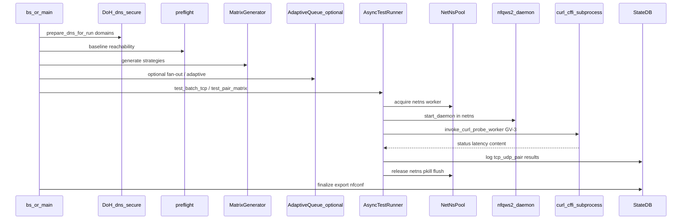
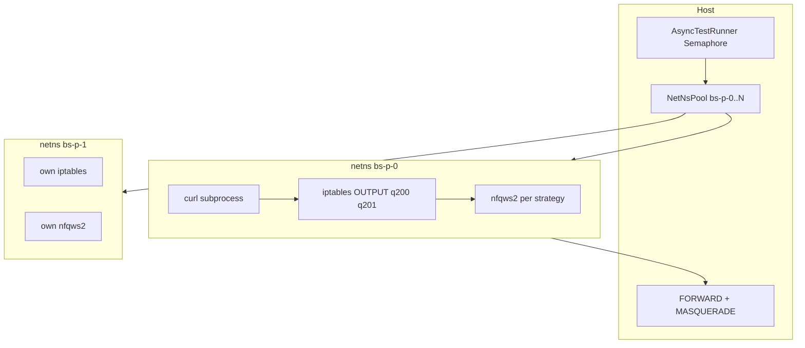
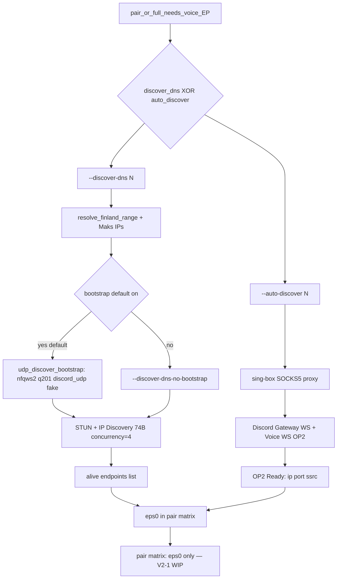
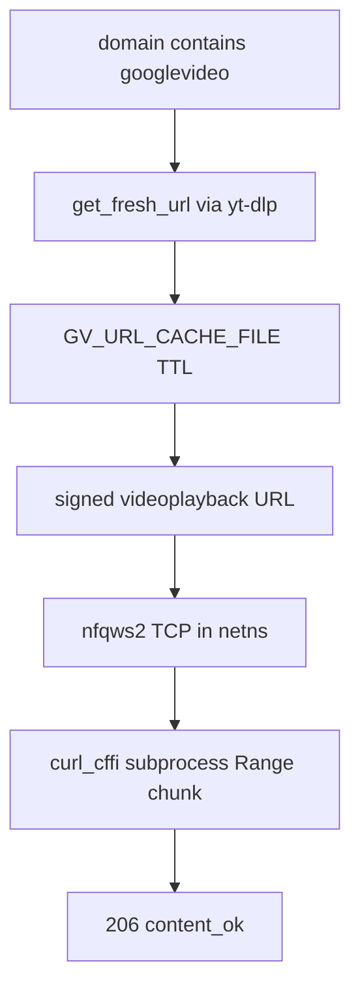

# Architecture — blockcheckS

Canonical data-flow reference for the async scan path (1.3.1+).

## Main runtime flow (`bs scan` / `bs pair` / `bs full`)



## NetNsPool scale (parallel workers)

Isolation is **per network namespace**, not distinct host NFQUEUE numbers.
Workers reuse qnum 200 (TCP) / 201 (UDP) **inside** each ns — queues are
netns-local, so `--parallel N` does not collide across workers.



Throughput lever on a Xeon-class host: raise `--parallel` first.
`nftables` vmap multiplexing (todo B7) is for host-shared / mark→queue designs,
**not** a prerequisite for `parallel > 4` under the current netns model.
Pi2 / ~1 GB RAM: keep `--parallel 1` (max 2).

## Module map

| Task | Module |
|------|--------|
| CLI / argparse | `blockchecks.cli` (entry: `bs.py`) |
| Mass orchestration | [`main.py`](../src/blockchecks/main.py) |
| Strategy matrix | [`engine/matrix_generator.py`](../src/blockchecks/engine/matrix_generator.py) |
| Domain loader + denylist | [`engine/domain_loader.py`](../src/blockchecks/engine/domain_loader.py) |
| Preset path jail | [`cli/presets.py`](../src/blockchecks/cli/presets.py) |
| Preflight | [`engine/preflight.py`](../src/blockchecks/engine/preflight.py) |
| Parallel TCP/UDP/pair | [`engine/async_runner.py`](../src/blockchecks/engine/async_runner.py) |
| Probe worker contract | [`engine/base_worker.py`](../src/blockchecks/engine/base_worker.py) (Worker ABC + BaseInNsWorker) |
| Curl probe public API | [`service/probe.py`](../src/blockchecks/service/probe.py) |
| Curl/UDP subprocess | [`engine/in_ns_workers.py`](../src/blockchecks/engine/in_ns_workers.py) (`python -m blockchecks.engine.in_ns_workers --mode curl\|udp`); `_probe_worker.py`/`_curl_probe_worker.py` are back-compat proxies |
| Sync single-ns | [`engine/test_runner.py`](../src/blockchecks/engine/test_runner.py) |
| Adaptive runner / queue | `adaptive_runner.py`, `adaptive_queue.py` |
| TCP fan-out | [`engine/tcp_fanout.py`](../src/blockchecks/engine/tcp_fanout.py) |
| nfqws2 lifecycle | [`service/nfqws2.py`](../src/blockchecks/service/nfqws2.py) (+ `service/nfqws2_settle.py` `_wait_nfqws2_gone`) |
| netns + iptables | `service/netns_pool.py`, `service/firewall.py` |
| System deps / zapret2 fetch | [`engine/system_deps.py`](../src/blockchecks/engine/system_deps.py) |
| XDG paths | [`engine/paths.py`](../src/blockchecks/engine/paths.py) |
| TLS / content / DoH | `checkers/tcp_tls`, `curl_probe`, `dns_secure` |
| Voice UDP / discover | `udp_voice`, `voice_dns`, `voice_discovery` |
| Composite config test | [`checkers/composite_runner.py`](../src/blockchecks/checkers/composite_runner.py) |
| Export keenetic | `nfconf.py`, `engine/conf_builder.py` (single-source arg sanitization) |
| Persistence | `engine/store/` (RunStateStore / SqliteRunStore) |
| Strategy families | `engine/generators/families/{split,fake,tamper}.py` + `_helpers.py` (StrategyParams) |

## Canonical vs legacy paths

| Command | Runner | Notes |
|---------|--------|-------|
| `bs scan`, `bs pair` | **async** `async_runner` | canonical |
| `bs full` | **async** via `main.py` | mass matrix |
| `bs tcp`, `bs udp` | **sync** `test_runner` | single strategy |
| `bs composite` | one netns + one nfqws2 | multi-domain config |

Known limitation: `bs scan` forces `auto_discover=None` (see [guide.md](guide.md)).

## Voice discovery (discover-dns vs auto-discover)

UDP bootstrap does **not** run before `--auto-discover`. Paths are **mutually
exclusive** (`check_discover_mutex` in `voice_dns.py`).



| Step | discover-dns | auto-discover |
|------|--------------|---------------|
| VPN | not required | sing-box SOCKS5 (`BLOCKCHECKS_PROXY`) |
| UDP bootstrap | **default on** (host NFQUEUE q201, `discord_udp`) | no |
| Opt-out | `--discover-dns-no-bootstrap` | — |
| Probe | STUN + IP Discovery on host | Gateway WS → Voice WS |
| Mutex | cannot combine with `--auto-discover` | cannot combine with `--discover-dns` |
| Code | `voice_dns.discover_dns_alive` | `voice_discovery` |
| Discord token | not needed | `BLOCKCHECKS_SETTINGS` (refuse world-writable) |

Bootstrap is recommended on DPI networks but **not hard-fail** — on error,
probing continues without nfqws2.

## googlevideo probe (GV-1 current)

Signed `videoplayback` URLs via yt-dlp cache (`bs_gv_url_cache.json`) are the
**current** path (`prepare_googlevideo_probe` / GV-3 worker). Apex
`https://googlevideo.com` alone is not the success criterion.



## Preflight Triage (Wave 1 + Wave 2)

Before the strategy scan, `run_preflight_async` builds a deterministic
`TriageProfile` of the ISP/DPI interference:

```
preflight (run_preflight_async)
 ├── DNS audit (UDP vs DoH) → dns_hijacked / dns_sinkhole
 ├── L3/L4 probe (l3_probe) → unbypassable_l3 (SYN drop / ICMP block / RST)
 ├── stream triage (curl_probe) → stall 7-42KB + QoS plateau → requires_window_clamp
 ├── TLS fingerprint (curl_probe) → fingerprint-block + post-quantum CH
 └── raw QUIC Initial (quic_raw) → quic_drop / udp_blocked
```
The `TriageProfile` is passed to `StrategyGenerator.generate(triage=…)`:
- `unbypassable_l3` → generators return `[]` (desync cannot help).
- post-quantum CH → static numeric `pos=N` splits dropped (marker-based kept).
- `requires_window_clamp` / `prefer_quic` bias family ordering.
It also exposes `to_context()` — a compact feature vector for the online
bandit / S0 offline ranker. Per-probe failure phases are persisted to
`tcp_results.fail_phase` (via `classify_fail_phase`), and Lua `rst_in` events
(TTL of DPI RST) map to `TLS_RST_AT_SNI`.

## Service layer — `bs serve`

Resident on-the-fly probe server (`service/probe_service.py` + `server.py`):
- **Unix socket core** (`asyncio.start_unix_server`, no deps) + thin HTTP bridge.
- Holds a warm `NetNsPool` — probes a domain/strategy without paying boot cost.
- **Fair exclusion**: while a long-term campaign owns `run.lock`, `/probe`
  returns `423 busy/campaign_active` (fail-fast); otherwise serves requests.
- Contract: `POST /probe {domains, strategies, protocol, timeout}` →
  `[{domain, strategy_id, status, fail_phase, latency_ms, http_code, fingerprint_matched}]`.

## DNS resolution

**Default:** DoH pre-resolve (`dns_secure` / `prepare_dns_for_run`) when secure DNS
is enabled; netns still has `nameserver 8.8.8.8` as fallback for unresolved
lookups. `--no-secure-dns` skips DoH.

## Public vs internal API

**Public (stable):**

- Entry points: `bs`, `bc-main`, `bc-nfconf`
- `blockchecks.engine.StrategyItem`, `StateDB`, `matrix_fingerprint`
- `blockchecks.service.probe.invoke_curl_probe_worker`, `probe_request_dict`
- `blockchecks.service.nfqws2.start_daemon`, `Nfqws2Manager`
- `blockchecks.checkers.TlsResult`, `check_tls`
- `conf_builder.build_keenetic_conf`, `build_raw_conf`
- `engine.preset_paths.resolve_domain_preset`, `resolve_strategy_preset` (CLI re-exports)

**Internal (do not import from outside):**

- Private settle helpers; async_runner thin aliases (`_nfqws2_daemon` → `start_daemon`)

See [package.md](package.md) for import graph. Operational guide: [guide.md](guide.md).
