# Architecture — blockcheckS 1.4.0

Канон **как устроен прогон** и **почему так**, а не только список модулей. Операторские флаги и DDL вынесены:

| Документ | Что там, а не здесь |
|---|---|
| [guide.md](guide.md) | флаги CLI, примеры, troubleshooting |
| [package.md](package.md) | дерево файлов, LOC, XDG-пути |
| [database.md](database.md) | схема SQLite, resume SQL, harvest manifest |
| [custom_lua.md](custom_lua.md) | shm layout, `scan_pick`, Mode A/B backlog |
| [api.md](api.md) | контракт socket / HTTP / MCP |
| [mcp.md](mcp.md) / [mcp-skill.md](mcp-skill.md) | установка клиентов, 22 tools |
| [ci-selfhosted.md](ci-selfhosted.md) | self-hosted `[probe]` runner |

**1.4.0 в одном абзаце.** Campaign TCP (`scan` / `pair` / `full`) всегда **lua_bridge**: один nfqws2 на батч стратегий, стратегия передаётся через `/dev/shm`. `--classic` / `--probe-backend classic` / `BLOCKCHECKS_PROBE_BACKEND=classic` → warning + map в lua_bridge. One-shot (`bs tcp`, `composite`, fan-out) по-прежнему запускают `start_daemon` на каждую стратегию. Campaign PASS считается как HTTP OK **и** APPLIED (`campaign_pass`); lua_bridge записывает HTTP-200 без APPLIED как FAIL. Resume работает по `run_id` + fingerprint; skip-ключи scoped к этому `run_id`. Карантин доменов сидируется **только** при `--resume`. MCP `stop_campaign` сначала делает `bs stop` (SIGTERM по `run.lock`); если кампании нет — останавливает `bs serve`.

---

## 1. Обзор data-flow

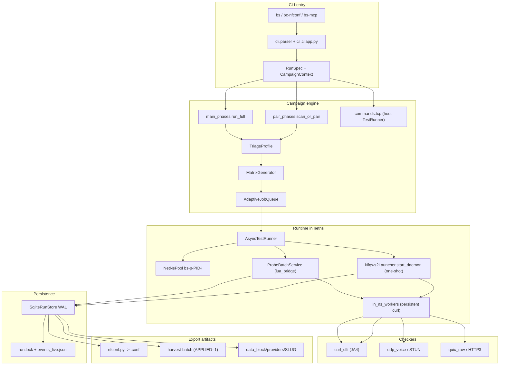

**Изоляция.** Оркестратор Python работает на хосте. nfqws2 и curl-субпроцессы исполняются **внутри network namespace** (`ip netns exec`). NFQUEUE 200 (TCP) и 201 (UDP) локальны внутри каждого namespace, поэтому `--parallel N` не требует разных queue number на хосте. Для каждого воркера NetNsPool создаёт veth-пару, настраивает NAT и правила OUTPUT → NFQUEUE; veth/NAT сам по себе не блокирует bypass (oneshot в том же namespace даёт HTTP 200).

---

## 2. Слои кода

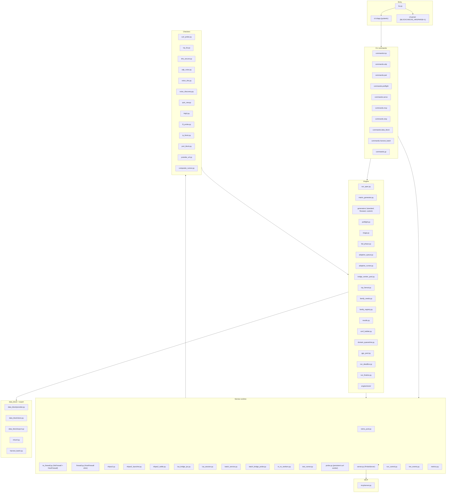

Правило archon (`[tool.blockchecks.architecture]`): `checkers` / `engine` / `service` / `data_block` **не** импортируют `cli` и entry (`bs.py`, `main.py`). Это позволяет переиспользовать движок из `bs serve`, `bc-nfconf` и тестов без таскания argparse.

---

## 3. Вход CLI

Дефолтный парсер — **pydantic CliApp** (`cli/cliapp.py`). Флаги описываются в `cli/parser.py` и валидируются через `RunSpec`. Старый argparse включается переменной `BLOCKCHECKS_ARGPARSE=1`.

`bs.py` — тонкий entry → `cli.parser.main`. Console scripts: `bs`, `bs-mcp`, `bc-nfconf`, `bc-main`.

| Команда | Куда | Раннер | Примечание |
|---|---|---|---|
| `bs scan` | `cmd_pair` (`tcp_only=True`) | `AsyncTestRunner` + lua_bridge | UDP/авто-дискавер сброшены |
| `bs pair` | `cmd_pair` + UDP / pair matrix | async | использует `eps[0]` из voice discover |
| `bs full` | `main.run_full` → `main_phases` | async, все фазы | adaptive queue по умолчанию |
| `bs tcp` / `bs udp` | `cmd_tcp` / `cmd_udp` | sync `TestRunner` | host или один netns |
| `bs composite` | `checkers.composite_runner` | один ns + один nfqws2 | one-shot `start_daemon` |
| `bs preflight` | `engine.preflight` | без матрицы | `TriageProfile` в stdout |
| `bs serve` | `service.server` + `ProbeService` | тёплый пул | unix-socket + HTTP |
| `bs mcp` / `bs-mcp` | FastMCP stdio → unix-сокет | extra `[mcp]` | ленивый импорт |
| `bs stop` | `run_control.request_graceful_stop` | SIGTERM | по pid из `run.lock` |
| `bs harvest-batch` | `harvest_batch` | PASS **и** `bridge_applied=1` | validation-grade rows |
| `bs gc` | prune логов / `--db-days` | dry-run default | skipped при `run.lock` |
| `bs data-block` | XDG → git checkout | не пишет submodule во время скана | `--data-block-sync` |
| `bs bench-settle` | калибровка settle/curl | отдельная команда | |

Перед кампанией: `apply_profile` (`--profile smoke|fast|20h`) → `RunSpec.from_args` → `run_session` (создаёт `run.lock`).

---

## 4. Поток кампании

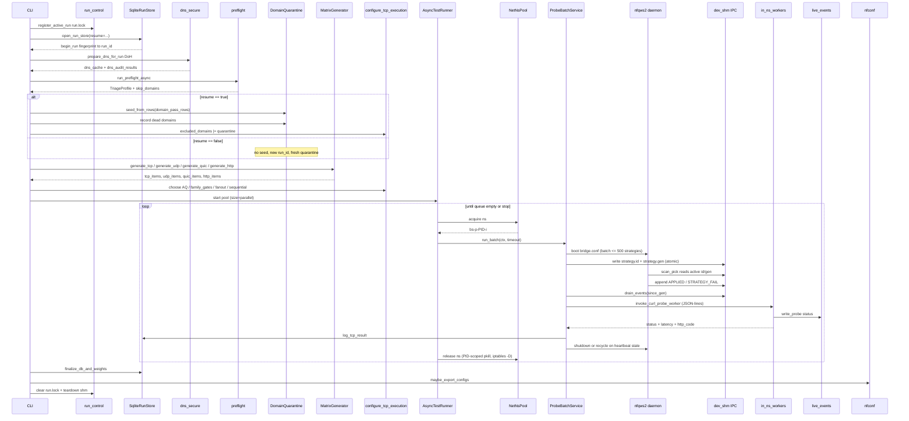

Фазы `bs full` (`main_phases.py`):

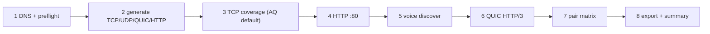

1. DNS + preflight (`--no-preflight`, `--quick`, `--skip-*`).
2. Генерация стратегий по домену `primary`.
3. TCP × coverage. По умолчанию — **adaptive queue**; альтернативы — `family_gates`, `fan-out`, последовательный item×domain.
4. HTTP :80 — если не `--no-http` / `--http-off`.
5. Voice discover — если не `--no-voice` / `--tcp-only`.
6. QUIC/HTTP3 — если не `--no-quic` / `--http3-off`.
7. Pair matrix — TCP+UDP, только если voice не отключён.
8. Export + summary (`--export-on-stop` при дедлайне).

`RunSpec` / `CampaignContext`: `use_adaptive ← not no_adaptive`, `try_wssize ← not no_wssize`, `disable_ech ← --no-ech`. Сырой `Namespace` всё ещё живёт внутри фаз для совместимости; новые поля добавляются в `RunSpec`.

---

## 5. Campaign TCP: lua_bridge

Campaign TCP (`scan` / `pair` / `full`) всегда идёт через **lua_bridge**: один nfqws2-демон на батч стратегий, переключение стратегии без restart. Это критично, потому что restart nfqws2 на каждую стратегию стоит 0.2–0.4s (pkill + fork + три `--lua-init` + NFQUEUE bind), что на 300k+ стратегий превращает короткий скан в дни.

| | lua_bridge campaign | one-shot |
|---|---|---|
| Кто | `scan` / `pair` / `full` | `bs tcp`, `composite`, fan-out |
| nfqws2 | один процесс на батч | `start_daemon` на каждую стратегию / конфиг |
| Стратегия | `strategy.id` + `strategy.gen` в `/dev/shm` | `--lua-desync` в argv |
| Код | `batch_service` + `lua_bridge_ipc` + `BridgeSession` | `nfqws2_launcher` + `TestRunner` |
| PASS для AQ/harvest | `campaign_pass`: HTTP OK ∧ APPLIED | HTTP OK (`bridge_applied=None`) |

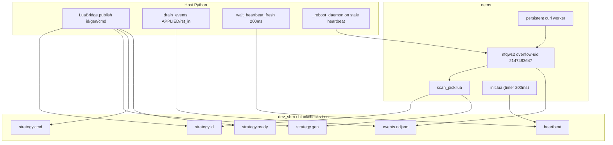

**IPC `/dev/shm`.** `LuaBridge.publish` атомарно пишет `strategy.id`, `strategy.gen`, `strategy.cmd` и `strategy.ready` через staging + `os.replace`. Lua-сторона (`scan_pick`) читает id/gen только когда `strategy.ready == strategy.gen`. Это защищает от рассогласования: gen коммитится первым, ready последним.

**Heartbeat fence.** `init.lua` запускает таймер 200ms, который перезаписывает файл `heartbeat`. Python ждёт `wait_heartbeat_fresh` ≤1.0s (`HEARTBEAT_FRESH_MAX_AGE_S`, 5× период таймера) перед первой пробой. Если heartbeat stale (>3s) — демон мёртв или NFQUEUE bind не случился; `batch_service` перезагружает демон. Это закрывает тихую смерть bind без лога (bol-van/zapret2#300).

**Overflow-uid.** nfqws2 после `setuid` работает под UID **2147483647** (overflow-uid), который **не** совпадает с системным `nobody`. Поэтому `chmod`/`setfacl` на `nobody` бесполезен. `lua_bridge_ipc._ipc_relax_for_nobody` целит ACL на `2147483647`; fallback — `0777/0666` с warning. Если `/dev/shm/blockchecks/<ns>` создан демоном раньше Python ( leftover ), `Path.mkdir` падает с EPERM; используется `sudo -n mkdir -p` + `sudo -n chmod`.

**Никогда не делай `ip netns exec <ns> pkill nfqws2`.** `ip netns exec` не создаёт PID-namespace; pkill сканирует хостовый `/proc` и убивает **все** nfqws2 на машине. Освобождение namespace использует `metrics.pkill_nfqws2_in_ns(ns)` — PID-scope по netns inode.

**Проба HTTPS.** Постоянный curl worker (`in_ns_workers --mode curl`) запускается один раз на namespace; JSON-lines запрос/ответ. Чтение stdout идёт через `os.read` + remainder buffer, а не `TextIOWrapper.read(1)`: последний съедает JSON-строку целиком и даёт ложный timeout ~6–11s при живом HTTP 200. При уничтожении namespace обязательно вызывается `release_curl_probe_worker(ns)`, иначе кэш `_WORKERS` переживёт `ip netns delete` и ударит в мёртвый namespace.

Fan-out (`--curl-parallel`) на волне — **one-shot** `start_daemon`, не `scan_pick` (warning once). `bs tcp` без `--ns` — **host** + `TestRunner`, не netns-контроль.

---

## 6. Целостность PASS и экспорт

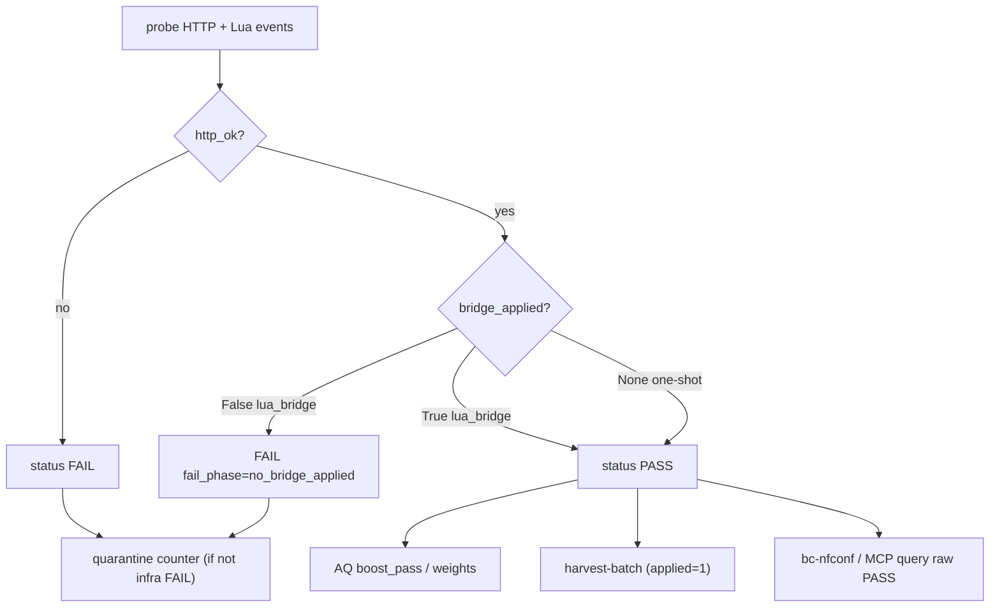

`campaign_pass` (реализация в `engine/results.py`):

```python
def campaign_pass(*, http_ok: bool, bridge_applied: bool | None) -> bool:
    match bridge_applied:
        case True:
            return http_ok
        case False:
            return False
        case None:
            return http_ok
```

- **Campaign / AQ** пишет HTTP-200 без APPLIED как FAIL (`fail_phase=no_bridge_applied`). Это убирает «PASS without APPLIED», вызванный nfqws2, который не увидел трафик (queue-bypass, пустой conf, ошибка бинда).
- **`harvest-batch`** и smoke `assert_smoke_db` требуют `bridge_applied=1` — это validation-grade выборка.
- **`bc-nfconf`**, MCP SQL (`query_strategies`, `generate_router_config`) и `SqliteRunStore.get_best_*` / `v_coverage` берут working-строки с `bridge_applied IS NULL OR = 1` (oneshot без колонки/NULL сохраняются; lua PASS без APPLIED отбрасывается). Старые DB без колонки MCP ретраит SQL без фильтра (warning в лог).
- **Infra FAIL** (`STOPPED_BEFORE_PROBE`, `NS_POOL_EXHAUSTED`, ошибки IPC) не засчитываются в `quarantine_min` — только реальные пробы DPI.

Карантин: 0 PASS за `--quarantine-min` (default 300) → таблица `quarantined`, AQ `excluded_domains`. Seed из истории — **только `--resume`**. После `seed_from_rows` обязателен ре-синк `queue.excluded_domains |= quarantine.exclude_domains()`, иначе мёртвые домены из БД продолжают пробоваться.

---

## 7. NetNsPool и параллелизм

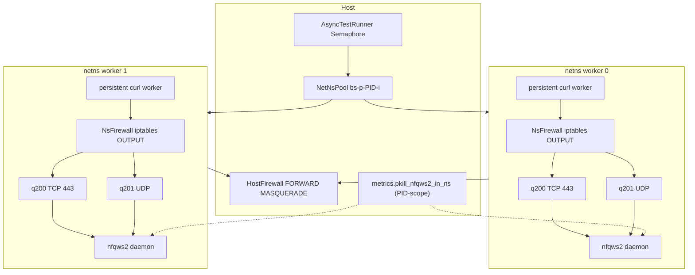

- q200 = TCP 443 (и :80 в http-фазе), q201 = UDP voice.
- `--parallel N` = размер пула namespace + semaphore.
- **NsFirewall** (`ns_firewall.py`) — правила **OUTPUT → NFQUEUE** внутри namespace; правила добавляются один раз при acquire, удаляются через `iptables -D` (не `-F OUTPUT`) при release.
- **HostFirewall** (`ns_firewall.py`) — правила **FORWARD + MASQUERADE** на хосте для veth/NAT; `service/firewall.py` — deprecated shim `Firewall = HostFirewall`.
- Teardown: PID-scoped `pkill_nfqws2_in_ns`, `iptables -D` для каждого tracked rule, `release_curl_probe_worker(ns)`, `rm -rf /etc/netns/<ns>`.
- `cleanup_env.sh` полный — только между кампаниями. Во время `week_cov` использовать `--orphans-only --exclude-prefix=bs-p-<pid>-`.
- veth/NAT **не** является блокером bypass: oneshot в том же namespace даёт HTTP 200 ~70ms. Ложные timeout в campaign historically были из-за IPC worker read loop и EPERM `/proc` у overflow-uid, а не из-за NAT.

---

## 8. TCP scheduler: AQ, family_gates, fan-out

`configure_tcp_execution` (`main_phases.py`) выбирает **ровно один** путь:

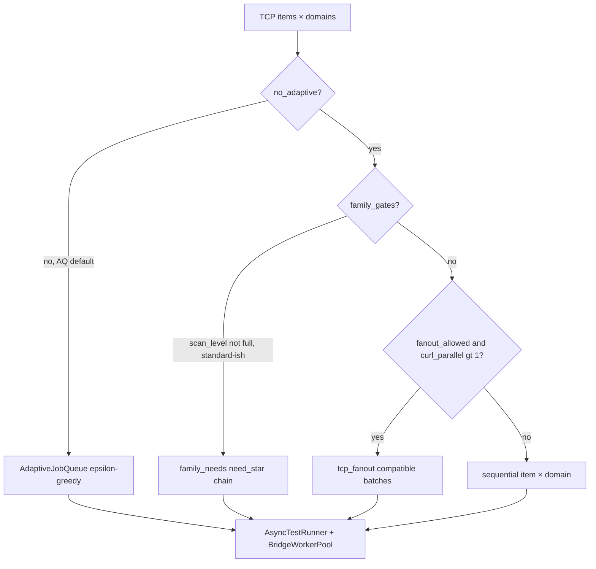

1. **Adaptive queue (default).** ε-greedy (~0.1): семьи / блобы / кластеры доменов, sibling expansion. Веса `scan_weights` подгружаются из БД и сохраняются в конце, если не `--no-adaptive-weights`. AQ доменная изоляция (`AQ_DOMAIN_ISOLATE`) не даёт нескольким воркерам одновременно пробовать один и тот же домен, чтобы избежать ложных PASS от параллельных коннектов.
2. **Family gates.** AQ выключен, `scan_level != full`, источники standard/fake/… `family_needs` по `TriageProfile` фильтрует семьи, которые точно не нужны (например, `quic_drop` → не генерировать TCP).
3. **Fan-out (B2).** Несколько доменов в одном curl-батче. `googlevideo` — **всегда solo**, не смешивается с обычными доменами, потому что probe_host и URL требуют yt-dlp и особой обработки.
4. **Последовательный.** item × domain один за другим.

`--fan-out` = шорткат «AQ + curl_parallel ≥ 4». При AQ `curl_parallel` ускоряет воркеры, но не добавляет второй планировщик.

`--reprobe-failed N`: на resume повторяет инфраструктурные FAIL, не DPI FAIL.

---

## 9. Preflight и triage

`run_preflight_async` → `TriageProfile` **до** генерации матрицы. Дефолт ON.

| Флаг | Эффект |
|---|---|
| (нет) | prolog + baseline + IP/port-block + DNS audit |
| `--quick` | только prolog |
| `--no-preflight` | всё выкл, включая persist L3 |
| `--skip-prolog` и др. | `PreflightOptions.from_args` |
| `--dpi-diag` | SNI WL, FAT, l4-25; не ставит `dns_sinkhole` |

Пробы: DNS UDP vs DoH; L3/L4 (`unbypassable_l3` → генераторы `[]`); stream stall → `wssize`; TLS/PQ режет `pos=N` сплиты; raw QUIC Initial → `quic_drop`.

Профиль передаётся в `generate(..., triage=)` и `map_triage_to_generators` (MCP). `fail_phase`: 32 токена; Lua `rst_in` → `TLS_RST_AT_SNI`.

---

## 10. Discord voice

Два **взаимоисключающих** пути (`check_discover_mutex`):

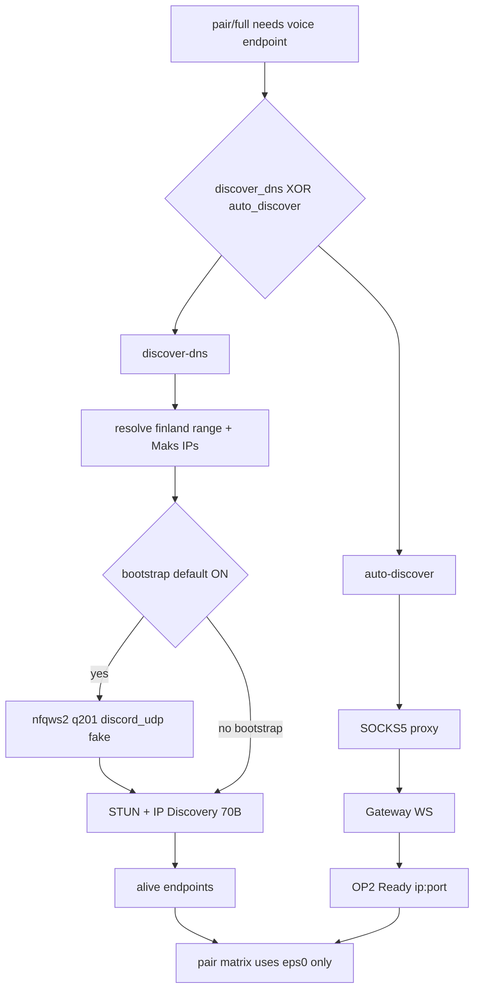

| | `--discover-dns` | `--auto-discover` |
|---|---|---|
| VPN | не нужен | SOCKS5 `BLOCKCHECKS_PROXY` |
| UDP bootstrap | host q201, blob `discord_udp` | нет |
| Токен | не нужен | `BLOCKCHECKS_SETTINGS` |
| Код | `voice_dns.discover_dns_alive` | `voice_discovery` |

Pair берёт **`eps[0]`**. `bs scan` голос не делает. UDP-теги `udp_voice`; `--udp-sources game` явно выбирает игровой preset.

---

## 11. googlevideo / GGC

Успех googlevideo — signed `videoplayback` (yt-dlp, кэш) + Range, HTTP 206, `content_ok`. SNI берётся из `ggc_pool.py` (`BLOCKCHECKS_GGC_MODE=synthetic|real|fixed`) и пишется в `tcp_results.probe_host`.

Цепочка IP: `dns.db(host)` → `[google].fallback_ips` / env → `CACHE/ggc_ips.json` → legacy. Синтетические хосты — NXDOMAIN by design; их живость проверяется только DoH, не curl из main-ns.

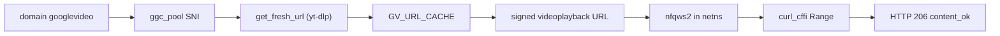

В fan-out `googlevideo` всегда solo и не смешивается с обычными доменами.

---

## 12. DNS

DoH (`prepare_dns_for_run`) + auto-pin `CURLOPT_RESOLVE`. Аудит UDP vs DoH пишется в таблицу `dns_audit_results`; расхождение не abort (пробы не ходят на UDP:53). Abort — sinkhole/bogon, если нет `--allow-dns-hijack`. `--no-secure-dns` выключает DoH. В netns `nameserver` — первый UDP из `[secure_dns].udp`. CIDR: `presets/ipset/` + user overlay.

---

## 13. Персистентность и resume

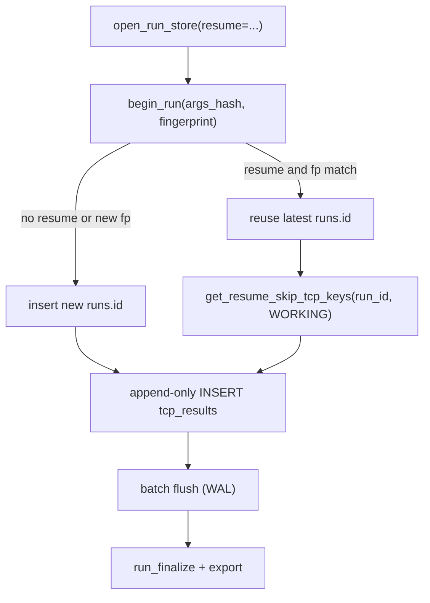

`SqliteRunStore`: WAL, long-lived writer, batch flush, `epoch_ms` / `settle_ms`, `PRAGMA wal_checkpoint`. Схема: [database.md](database.md).

- Без `--resume`: новый `run_id`, skip пуст, карантин не сидируется.
- С `--resume` и drift fingerprint: отказ.
- Skip keys scoped к `run_id` + fingerprint. Latest row = `MAX(id)` на пару `(strategy, domain)`. UNIQUE на `tcp_results` нет.
- XDG `pass_strategies`: `UNIQUE(strategy, domain, protocol)`.
- После `full`: `run_finalize` → `nfconf` + `conf_builder` (санитизация, `4pda`→`b4pda`). Runtime пишет только XDG `data_block/providers/<slug>/`. Git-снимок: `bs data-block`. `--data-block-sync` — export+commit если есть `data_block/.git`.
- `latency_ms=0` — валидный лучший результат.

---

## 14. Persistent curl worker: чтение stdout

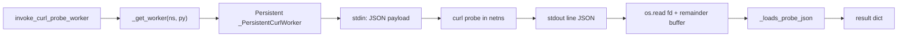

- `_readline_timed` использует `os.read` + `bytearray` remainder, а не `TextIOWrapper.read(1)`.
- `select` ждёт появления данных; `os.read` читает чанками. Если JSON уже в буфере, `TextIOWrapper` мог проглотить его на первом байте и вызвать ложный timeout.
- stderr дренируется в отдельном thread с кольцевым буфером 8KB, чтобы pipe не забился.
- При destroy namespace `release_curl_probe_worker(ns)` убивает процесс и убирает из `_WORKERS`.

---

## 15. `bs serve`, HTTP и MCP

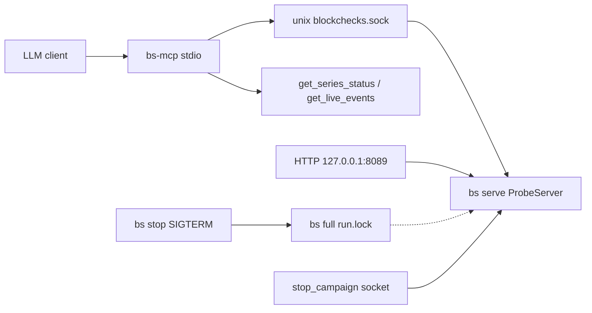

- Сокет: `~/.local/state/blockcheckS/blockchecks.sock`, 0600. Не `/var/run`.
- HTTP bridge: localhost; без `--http-token` мост не стартует. Все маршруты кроме `/api/health` требуют `Authorization: Bearer <token>`.
- MCP extra `mcp>=1.1,<2`. 22 tools: дисковые во время кампаний; демонные — живые пробы.
- **`stop_campaign`**: сначала `request_graceful_stop` (как CLI `bs stop` по `run.lock`); если активного прогона нет — socket `stop` демона `bs serve`.
- Fair exclusion: `run.lock` → probe возвращает **423 busy**.
- `get_series_status.backend` всегда `"lua_bridge"`. TCP PASS-агрегации MCP/DAO: `bridge_applied IS NULL OR = 1`.
- Live: `events_live.<pid>.jsonl`, `current_probe.json`, SIGUSR1 debug toggle.

---

## 16. `run.lock` и XDG

`service/run_control.py`: одна кампания или `serve` на хост. `run.lock` содержит `pid`, `command`, `started_at`, `db_path`, `cwd`, `argv`. Пути через `paths._resolve_xdg`: euid 0 + `SUDO_USER` → home пользователя, не `/root`. `bs stop --force` снимает lock. Не запускай `sudo bs` целиком — sudo только внутри движка (netns/nfqws2).

---

## 17. Карта модулей

### CLI и оркестрация

| Задача | Модуль |
|---|---|
| CliApp / argparse | `cli/cliapp.py`, `cli/parser.py` |
| Профили | `cli/profiles.py` |
| Пресеты | `cli/presets.py`, `engine/preset_paths.py` |
| `bs full` | `main.py`, `main_phases.py` |
| `scan`/`pair` | `cli/commands/pair.py`, `pair_phases.py` |
| Дедлайн | `engine/run_deadline.py` |
| Терминал | `terminal.py` |

### Движок

| Задача | Модуль |
|---|---|
| Typed spec | `run_spec.py` |
| Матрица / семьи | `matrix_generator.py`, `generators/families/` |
| Preflight / fail | `preflight.py`, `triage.py`, `fail_phase.py` |
| AQ | `adaptive_queue.py`, `adaptive_runner.py` |
| Quarantine | `domain_quarantine.py` |
| GGC | `ggc_pool.py` |
| Executors / pair / bridge pool | `probe_executors.py`, `pair_matrix_runner.py`, `bridge_worker_pool.py`; `service/batch_scheduler.py` |
| Fan-out | `tcp_fanout.py` |
| Results | `results.py` (`campaign_pass`) |
| Async runner | `async_runner.py` |
| Conf builder | `conf_builder.py` |
| Store | `engine/store/` |
| XDG / deps | `paths.py`, `system_deps.py` |

### Service runtime

| Задача | Модуль |
|---|---|
| Пул ns / iptables | `netns_pool.py`; `ns_firewall.py` (`NsFirewall` in-ns, `HostFirewall` host); `firewall.py` shim |
| nfqws2 lifecycle | `nfqws2.py`, `nfqws2_launcher.py`, `nfqws2_settle.py` |
| pkill / RSS | `metrics.py` |
| Live journal | `live_events.py` |
| lua_bridge batch | `batch_service.py`, `batch_bridge_probe.py`, `lua_session.py` |
| IPC | `lua_bridge_ipc.py`, `lua_conf.py`, `lua_netns.py` |
| Curl/UDP workers | `probe.py`, `in_ns_workers.py` |
| Oneshot sync runner | `test_runner.py` |
| Serve / lock | `server.py`, `run_control.py` |

### Checkers / persist

`tcp_tls`, `curl_probe`, `dns_secure`, `l3_probe`, `ip_block`, `port_block`, `quic_raw`, `http3`, `udp_voice`, `voice_dns`, `voice_discovery`, `youtube_url`, `dpi_diag/*`, `composite_runner`.

`nfconf.py` · `data_block/` · `harvest_batch.py` · `shortlist` · `provider_import.py`. byedpi: [byedpi_engine.md](byedpi_engine.md).

---

## 18. Публичный API

Стабильно: entry points; `StrategyItem`, `RunStateStore`, `matrix_fingerprint`, `open_run_store`; `invoke_curl_probe_worker`; `start_daemon`, `Nfqws2Manager`; `TlsResult`, `check_tls`; `build_keenetic_conf` / `build_raw_conf`; `preset_paths.resolve_*`.

Не импортировать снаружи: private settle; `async_runner._nfqws2_daemon`; `_probe_worker` proxies; поля `Namespace` вне `RunSpec`.

---

## 19. Известные ограничения 1.4.0

1. `bs scan` — TCP-only; `--auto-discover` сбрасывается.
2. Pair / discover-dns: в матрицу используется только `eps[0]`.
3. Fan-out волна — one-shot, не `scan_pick`.
4. Host-mode (nfqws2 на хосте без netns) и Lua Mode A (демон на весь прогон) — бэклог.
5. Persistent curl worker (`service/probe.py`) держит stderr в PIPE и дренирует его; launcher nfqws2 пишет stdout+stderr в `open_out_capture` (файл / DEVNULL), не в PIPE.
6. QUIC на Fryazino не работает; curl_cffi `http_version=3` даёт ALPN-ложняк.

Операторский гайд: [guide.md](guide.md). Кампании: [scripts/README.md](../scripts/README.md). Смоки и отладка: [dev/README.md](../dev/README.md).
