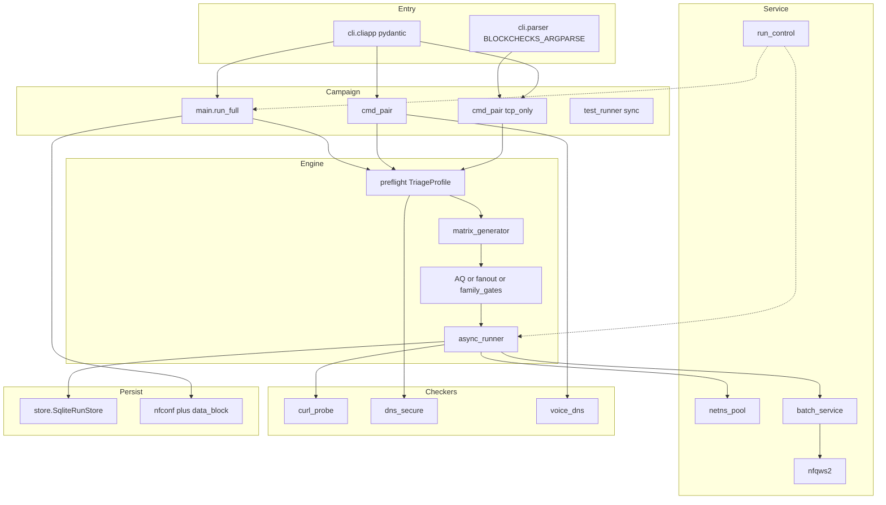
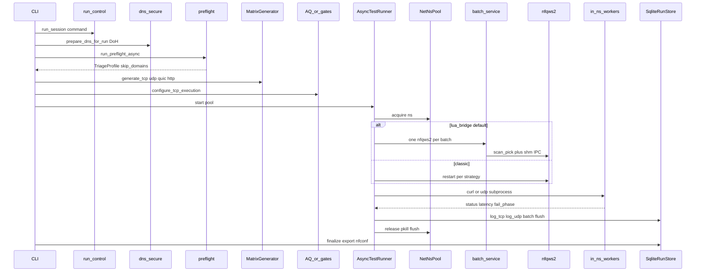
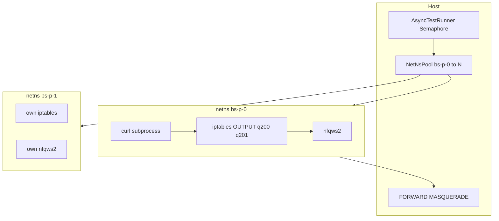
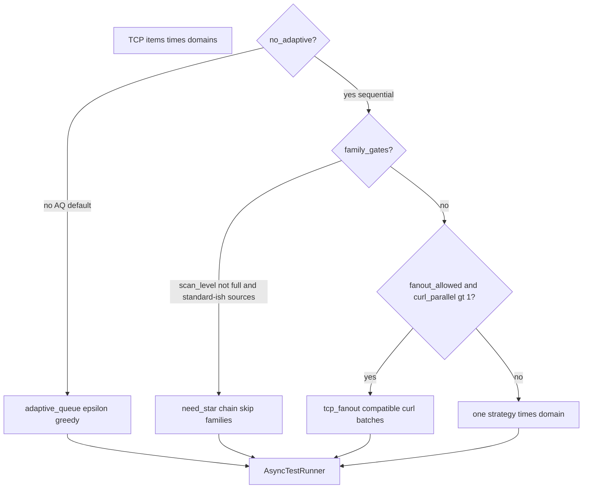
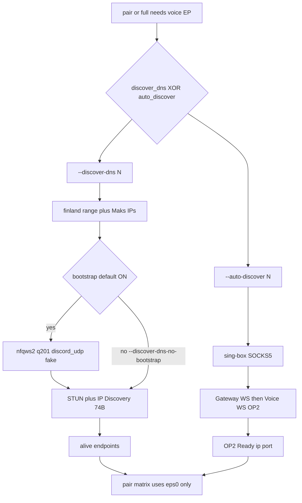
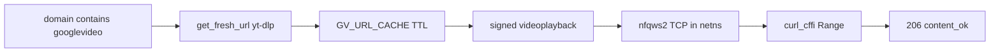
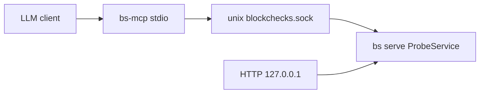

# Architecture — blockcheckS

Канонический разбор **как устроен прогон** (1.3.7+). Не дублирует:

| Документ | Что там, а не здесь |
|---|---|
| [guide.md](guide.md) | флаги CLI, примеры команд |
| [package.md](package.md) | дерево файлов, LOC, XDG-пути |
| [database.md](database.md) | схема SQLite, resume SQL |
| [custom_lua.md](custom_lua.md) | Lua IPC, `scan_pick`, Mode A/B |
| [api.md](api.md) | контракт socket / HTTP / MCP |
| [mcp.md](mcp.md) | установка MCP-клиентов |

---

## Слои

**Правило изоляции:** Python-оркестратор живёт на хосте; nfqws2 и curl — **внутри netns**. Очереди NFQUEUE 200/201 локальны для namespace, поэтому `--parallel N` не требует разных qnum на хосте.

---

## Вход CLI

Дефолт — **pydantic CliApp** (`cli/cliapp.py`). Флаги по-прежнему описываются в `cli/parser.py` (`add_campaign_args`, `add_backend_args`, …). Старый argparse: `BLOCKCHECKS_ARGPARSE=1`.

`bs.py` — тонкий entry → `cli.parser.main` (или CliApp). Console scripts: `bs`, `bs-mcp`, `bc-nfconf`, `bc-main`.

| Команда | Куда идёт | Раннер |
|---|---|---|
| `bs scan` | `cmd_pair` с `tcp_only=True`, **без** UDP/voice | async `AsyncTestRunner` |
| `bs pair` | `cmd_pair` + UDP/pair matrix | async |
| `bs full` | `main.run_full` → `main_phases` | async, все фазы |
| `bs tcp` / `bs udp` | `cmd_tcp` / `cmd_udp` | **sync** `TestRunner` (один netns) |
| `bs composite` | `composite_runner` | один netns + один nfqws2 на конфиг |
| `bs preflight` | `engine.preflight` без матрицы | без полного пула стратегий |
| `bs serve` | `service.server` + `ProbeService` | тёплый пул |
| `bs mcp` / `bs-mcp` | FastMCP stdio → unix-сокет демона | extra `[mcp]` |
| `bs stop` | `run_control` | снимает `run.lock` |
| `bs bench-settle` | калибровка settle/curl | отдельная команда |
| `bs harvest-batch` | `harvest_batch` | кандидаты из state.db → batch.txt + manifest v1 |
| `bs gc` | prune артефактов | dry-run по умолчанию |

`bs scan` **намеренно** обнуляет `auto_discover` и UDP-источники: это TCP-only обёртка над тем же `cmd_pair`. Голос и `--auto-discover` — у `pair` / `full`. Это не баг CLI, а контракт команды (см. [guide.md](guide.md) «известные ограничения»).

Перед кампанией: `apply_profile` (`--profile smoke|fast|20h`) → `RunSpec.from_args` → `run_session` (ставит `run.lock`).

---

## Поток кампании (`scan` / `pair` / `full`)

Фазы `bs full` (`main_phases.py`), порядок:

1. DNS + preflight (можно урезать `--no-preflight` / `--quick` / `--skip-*`)
2. Генерация TCP (и UDP/QUIC/HTTP, если не сняты флагами)
3. TCP × coverage (AQ **по умолчанию**)
4. HTTP :80 — если не `--no-http`
5. Voice discover — если не `--no-voice` / `--tcp-only`
6. QUIC — если не `--no-quic`
7. Pair matrix TCP×UDP — тоже подчиняется `--no-voice`
8. Export + summary

`--no-voice` с 1.3.7 **не генерирует** UDP и **не запускает** pairs (раньше скипался только DNS-discover, а матрица на 50 UDP × `--pair-max` всё равно крутилась).

`RunSpec` / `CampaignContext` (`engine/run_spec.py`) — типизированный снимок флагов. Ключевые производные:

- `use_adaptive` ← `not no_adaptive` (AQ ON)
- `try_wssize` ← `not no_wssize`
- `disable_ech` ← `--no-ech`
- `no_voice` / `tcp_only` / `no_http` / `no_quic`

Сырой `argparse.Namespace` ещё живёт в фазах; `RunSpec` — канон для новых полей.

---

## Два бэкенда пробы

Один и тот же `AsyncTestRunner`, разный способ крутить nfqws2.

| | **lua_bridge** (дефолт с 1.3.1) | **classic** |
|---|---|---|
| nfqws2 | один демон на **батч** стратегий | рестарт на **каждую** стратегию |
| выбор стратегии | Lua `scan_pick` читает id из `/dev/shm` | аргументы `--lua-desync` в новом процессе |
| когда | обычный `scan`/`pair`/`full` | `--classic`, `--probe-backend classic`, fan-out волны |
| код | `batch_service` + `lua_bridge_ipc` | `nfqws2.start_daemon` на item |

Приоритет выбора: `--classic` > `--probe-backend` > `--lua-bridge` > `BLOCKCHECKS_PROBE_BACKEND` > дефолт `lua_bridge`.

`--lua-bridge-compare` гоняет **оба** и пишет drift (для `dev/release_smoke.sh`, не для ежедневного скана). Fan-out (`--fan-out` / `curl_parallel>1` без AQ) всегда ходит в classic на волне — смешанный curl-батч не умеет горячую смену instance id.

Подробности shm-файлов и `smart_fallback`: [custom_lua.md](custom_lua.md).

Проба HTTPS: не host-curl, а **субпроцесс** `python -m blockchecks.engine.in_ns_workers --mode curl` внутри netns (`service/probe.py` → `invoke_curl_probe_worker`). UDP voice — тот же модуль `--mode udp`. Прокси `_probe_worker.py` / `_curl_probe_worker.py` — только back-compat импорты.

---

## NetNsPool и параллелизм

Изоляция **на namespace**, не на уникальный qnum хоста.

- q200 = TCP 443 (и HTTP :80 в http-фазе), q201 = UDP voice.
- `--parallel N` = размер пула + semaphore. На Xeon сначала поднимать parallel; на Pi2 — `1` (макс. 2).
- nftables vmap / SO_MARK (host-mode) — **не** нужны для `parallel > 4` в текущей модели; это отдельный бэклог ([todo.md](todo.md)).
- Cleanup: `pkill` nfqws2 в ns, снять iptables `-D` (никогда `-F OUTPUT`), вернуть veth. Хостовый сброс: `scripts/cleanup_env.sh` (полный — только между кампаниями; `--orphans-only` во время прогона). `NetNsPool._destroy_one` уже `rm -rf /etc/netns/<ns>`.

`Firewall` трекает правила, чтобы teardown был точечный.

---

## Планировщик TCP: четыре режима

`configure_tcp_execution` выбирает **один** путь:

1. **Adaptive queue (дефолт).** ε-greedy (по умолчанию 0.1): приоритет семей/блобов/кластеров доменов (discord/google/youtube/general), sibling expansion. Веса в `scan_weights` SQLite, если не `--no-adaptive-weights`.
2. **Family gates.** Только если AQ выключен, `scan_level != full`, источники standard/fake/… `family_needs` / `family_registry`: по `TriageProfile` не гонять заведомо бесполезные expander’ы.
3. **Fan-out (B2).** Несколько доменов в одном curl-батче, если профили совместимы. googlevideo — **всегда solo** (`tcp_fanout.CurlProfile.special`): свой `Range` и без ECH.
4. **Последовательный** item×domain.

`--fan-out` — шорткат «AQ + curl_parallel≥4». AQ и fan-out одновременно как два планировщика не живут: при AQ curl-parallel только ускоряет воркеры очереди.

---

## Preflight и triage

`run_preflight_async` → `TriageProfile` **до** матрицы. Дефолт ON.

| Флаг | Эффект |
|---|---|
| (нет) | полный prolog + baseline + IP/port-block + DNS audit |
| `--quick` | только prolog, без глубокого baseline/IP/port |
| `--no-preflight` | всё выкл, включая persist L3 |
| `--skip-prolog` и др. | точечно (`PreflightOptions.from_args`) |
| `--dpi-diag` | доп. оверлей (SNI WL, FAT, l4-25, …); **не** выставляет `dns_sinkhole` |

Пробы:

- DNS UDP vs DoH → `dns_hijacked` / `dns_sinkhole`
- L3/L4 (`l3_probe`) → `unbypassable_l3` (desync бесполезен → генераторы `[]`)
- stream stall / QoS (`curl_probe`) → `requires_window_clamp` (wssize)
- TLS fingerprint / PQ ClientHello → режутся числовые `pos=N` сплиты
- raw QUIC Initial (`quic_raw`) → `quic_drop` / `udp_blocked`

Профиль уходит в `generate(..., triage=)` и в `map_triage_to_generators` (MCP `triage` + prune семей). `to_context()` — компактный вектор для AQ.

`fail_phase` на результате: `classify_fail_phase` (32 токена). Lua `rst_in` (TTL RST DPI) → `TLS_RST_AT_SNI`.

Отдельная команда `bs preflight` — тот же движок, без генерации стратегий.

---

## Голос Discord

Два **взаимоисключающих** пути (`check_discover_mutex` в `voice_dns.py`):

| | `--discover-dns` | `--auto-discover` |
|---|---|---|
| VPN | не нужен | SOCKS5 `BLOCKCHECKS_PROXY` |
| UDP bootstrap | **вкл** (host q201, blob `discord_udp`) | нет |
| токен Discord | нет | `BLOCKCHECKS_SETTINGS` (файл не world-writable) |
| код | `voice_dns.discover_dns_alive` | `voice_discovery` |

Bootstrap при ошибке **не валит** прогон — дальше без nfqws2. Pair сейчас берёт **`eps[0]`** (мульти-EP — WIP). `bs scan` сюда не входит.

UDP-стратегии тегируются `udp_voice`; `--udp-sources game` явно, не по умолчанию.

---

## googlevideo (GV)

Критерий успеха — не `https://googlevideo.com`, а **signed `videoplayback`** (yt-dlp, кэш `bs_gv_url_cache.json`) + Range-chunk, HTTP 206, `content_ok`.

SNI для проб выбирается из пула `engine/ggc_pool.py` (`BLOCKCHECKS_GGC_MODE=synthetic|real|fixed`);
выбранный хост пишется в `tcp_results.probe_host`.

В fan-out googlevideo не смешивается с обычными доменами.

---

## DNS

Дефолт: DoH (`dns_secure.prepare_dns_for_run`) + auto-pin (`CURLOPT_RESOLVE`). Аудит UDP vs DoH — таблица; UDP≠DoH не останавливает прогон (пробы не ходят на UDP:53). Abort только на sinkhole/bogon (`--allow-dns-hijack`). `--no-secure-dns` выключает DoH. В netns `nameserver` — первый UDP из `[secure_dns].udp` (baked: `8.8.8.8`). CIDR sinkhole/CDN — `presets/ipset/` (user overlay `~/.config/blockcheckS/presets/ipset/`).

---

## Персистентность и экспорт

`engine/store/SqliteRunStore`: стратегии, `tcp_results` / `udp_results` / `pair_results` / `quic_results`, checkpoint fingerprint матрицы, `scan_weights`, triage snapshot. Батч-flush (`DEFAULT_DB_BATCH`, lock на drain). Схема: [database.md](database.md).

По окончании `full`: `run_finalize` → `bc-nfconf` (`nfconf.py` + `conf_builder` — единственная санитизация аргументов nfqws2).

- Keenetic: `--filter-l7` = протокол потока; `--payload` липкий до следующего `--payload=`. Circular: inbound `--in-range=-s5556`.
- Raw conf — для хоста (`BLOB_DIR`, `/opt/zapret2/lua`), **не** копировать на роутер как есть.
- `--ipset`: IP из DNS-кэша, CIDR через ip2net.

Runtime-провайдер пишется только в XDG `~/.local/share/blockcheckS/data_block/providers/<slug>/` (hosts, dns.db, strategies.db, triage.toml). Репозиторный submodule `data_block/` не трогается во время скана. Снимок для git: `bs data-block [--out DIR] [--git]`. `--data-block-sync` = тот же export+commit, если найден `data_block/.git`.

`data_block/` (submodule): провайдер-агностичные снимки (сейчас `default` + `llc_trc_fiord`). Синк в кампании — опциональный.

Ранжирование PASS: `latency_ms=0` — валидный лучший результат, не «нет замера».

---

## `bs serve`, HTTP, MCP

Три транспорта, один демон с тёплым пулом. Полный контракт: [api.md](api.md).

- Сокет: `~/.local/state/blockcheckS/blockchecks.sock` (не `/var/run`), 0600.
- HTTP: только localhost, без `--http-token` мост **не стартует**.
- MCP: optional extra `mcp>=1.1,<2`; без extra `bs --help` жив, `bs mcp` печатает hint.
- **Fair exclusion:** активная серия держит `run.lock` → `probe` / `find_strategy` → **423 busy**. Статус серии без демона: MCP `get_series_status` читает lock+DB.

`ProbeService` держит `AsyncTestRunner` + пул; `find_strategy` берёт `workers` из **размера пула**, не из несуществующего `runner.pool_size`.

---

## `run.lock`

`service/run_control.py`: одна кампания (`full`/`scan`/`pair`) или `serve` на хост. Файл XDG state, не cwd. `bs stop --force` снимает. Integration e2e чистит через `scripts/cleanup_env.sh` до/после теста.

---

## Карта модулей (по слоям)

### CLI и оркестрация

| Задача | Модуль |
|---|---|
| CliApp / argparse | `cli/cliapp.py`, `cli/parser.py` |
| Профили | `cli/profiles.py` |
| Пресеты (jail путей) | `cli/presets.py`, `engine/preset_paths.py` |
| `bs full` фазы | `main.py`, `main_phases.py` |
| `scan`/`pair` фазы | `cli/commands/pair.py`, `pair_phases.py` |
| Терминал | `terminal.py` |
| Дедлайн 20h | `engine/run_deadline.py` |

### Движок прогона

| Задача | Модуль |
|---|---|
| Typed spec | `engine/run_spec.py` |
| Матрица | `engine/matrix_generator.py` |
| Семьи TCP | `engine/generators/` + `families/{split,fake,tamper}.py` |
| Flowseal / custom lists | `generators/flowseal.py`, `custom.py` |
| Статический валидатор | `engine/static_validator.py` |
| Блобы | `engine/blob_aliases.py`, `blob_filter.py` |
| Preflight / triage / fail_phase | `preflight.py`, `triage.py`, `fail_phase.py` |
| AQ | `adaptive_queue.py`, `adaptive_runner.py` |
| Domain quarantine | `domain_quarantine.py` |
| GGC SNI pool | `ggc_pool.py` |
| Probe executors | `probe_executors.py` |
| Pair matrix | `pair_matrix_runner.py` |
| Bridge worker pool | `bridge_worker_pool.py` |
| Family gates | `family_needs.py`, `family_registry.py` |
| Fan-out | `tcp_fanout.py` |
| Async / sync раннер | `async_runner.py`, `test_runner.py` |
| Воркеры в ns | `in_ns_workers.py` |
| Конф nfqws2 | `conf_builder.py`, `nfqws_config.py` |
| Settle | `settle_profile.py`, `service/nfqws2_settle.py` |
| XDG / deps | `paths.py`, `system_deps.py` |

### Service

| Задача | Модуль |
|---|---|
| Пул ns | `netns_pool.py`, `firewall.py`, `ns_firewall.py` |
| nfqws2 | `nfqws2.py` |
| RSS / pkill helpers | `metrics.py` |
| Live probe journal | `live_events.py` |
| Батч classic/bridge | `batch_service.py`, `batch_bridge_probe.py`, `lua_session.py` |
| Lua IPC | `lua_bridge_ipc.py`, `lua_conf.py`, `lua_netns.py` |
| Тёплый probe | `probe_service.py`, `probe.py` |
| Unix+HTTP сервер | `server.py` |
| Lock | `run_control.py` |

### Checkers

`tcp_tls`, `curl_probe`, `dns_secure`, `l3_probe`, `ip_block`, `port_block`, `quic_raw`, `http3`, `udp_voice`, `voice_dns`, `voice_discovery`, `youtube_url`, `dpi_diag/*`, `composite_runner`.

### Persist / export

`engine/store/` · `nfconf.py` · `data_block/` · `harvest_batch.py` (manifest v1) ·
`shortlist_export.py` / `shortlist_import.py` · `provider_import.py`.

Альтернативный движок стратегий (не дефолт): `byedpi_translator.py` — [byedpi_engine.md](byedpi_engine.md).

---

## Публичный vs внутренний API

**Стабильно снаружи пакета:**

- entry points `bs`, `bc-main`, `bc-nfconf`, `bs-mcp`
- `blockchecks.engine`: `StrategyItem`, `RunStateStore`, `matrix_fingerprint`, `open_run_store`
- `service.probe.invoke_curl_probe_worker`
- `service.nfqws2.start_daemon`, `Nfqws2Manager`
- `checkers.TlsResult`, `check_tls`
- `conf_builder.build_keenetic_conf` / `build_raw_conf`
- `preset_paths.resolve_*`

**Не импортировать снаружи:** private settle helpers; тонкие алиасы `async_runner._nfqws2_daemon`; `_probe_worker` proxies; поля `argparse.Namespace`, которых нет в `RunSpec`.

Правила слоёв (archon): checkers/engine/service не импортируют `cli` и entry (`bs`, `main`). См. `[tool.blockchecks.architecture]` в pyproject и [api.md](api.md) §10.

---

## Известные ограничения (архитектурные)

1. `bs scan` — TCP-only; `--auto-discover` на scan бесполезен (сбрасывается).
2. Pair / discover-dns: в матрицу идёт `eps[0]`, остальные endpoints только логируются.
3. Fan-out и lua_bridge на одной волне несовместимы → classic.
4. Host-mode (без netns) и Lua Mode A (демон на весь прогон) — бэклог, не текущий data-path.
5. `stderr=PIPE` у nfqws2 без drain на success — риск заполнения pipe на болтливом `--debug`.

Операционный гайд: [guide.md](guide.md). Скрипты кампаний: [scripts/README.md](../scripts/README.md). Смоки: [dev/README.md](../dev/README.md).
