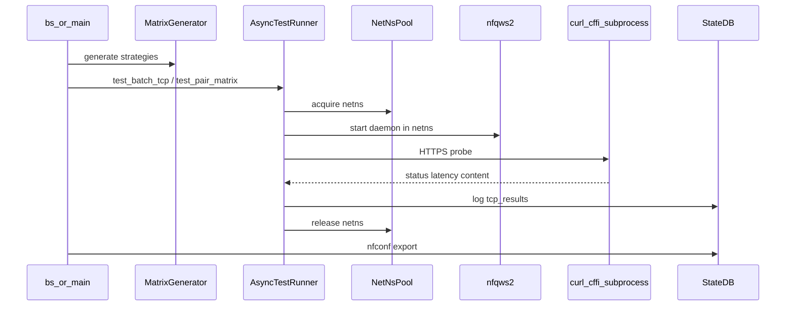
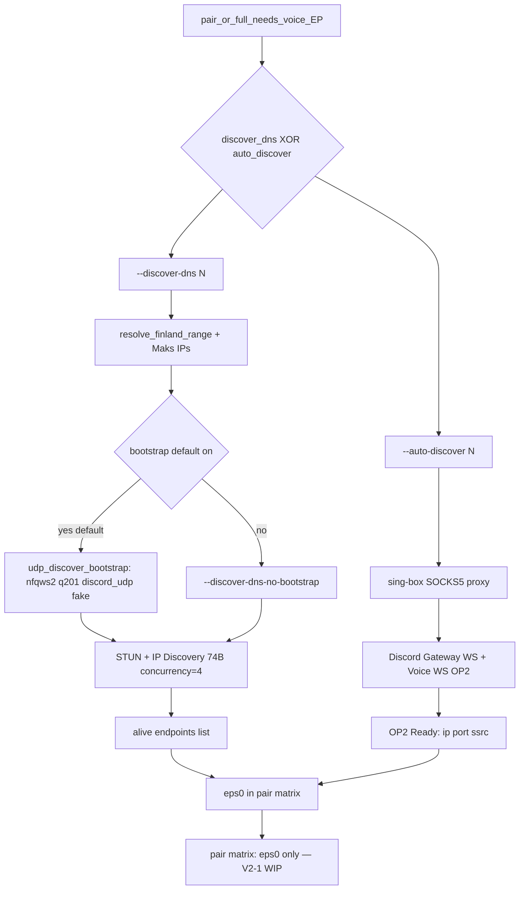
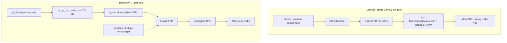

# Architecture — blockcheckS

Canonical data-flow reference. Supersedes [`tmp-scripts/README.md`](../tmp-scripts/README.md)
(deprecated architecture section).

## Main runtime flow (`bs scan` / `bs pair` / `bs full`)

## Module map

| Task | Module |
|------|--------|
| CLI / argparse | `blockchecks.cli` (entry: `bs.py`) |
| Mass orchestration | [`main.py`](../src/blockchecks/main.py) |
| Strategy matrix | [`engine/matrix_generator.py`](../src/blockchecks/engine/matrix_generator.py) |
| Parallel TCP/UDP/pair | [`engine/async_runner.py`](../src/blockchecks/engine/async_runner.py) |
| Sync single-ns (legacy) | [`engine/test_runner.py`](../src/blockchecks/engine/test_runner.py) |
| netns + iptables | [`netns_pool.py`](../src/blockchecks/engine/netns_pool.py), [`firewall.py`](../src/blockchecks/engine/firewall.py) |
| TLS/content check | [`checkers/tcp_tls.py`](../src/blockchecks/checkers/tcp_tls.py) |
| Voice UDP | [`checkers/udp_voice.py`](../src/blockchecks/checkers/udp_voice.py) |
| Discover-dns | [`checkers/voice_dns.py`](../src/blockchecks/checkers/voice_dns.py) |
| Auto-discover (VPN) | [`checkers/voice_discovery.py`](../src/blockchecks/checkers/voice_discovery.py) |
| Export keenetic | [`nfconf.py`](../src/blockchecks/nfconf.py), [`conf_builder.py`](../src/blockchecks/engine/conf_builder.py) |
| Persistence | [`db_logger.py`](../src/blockchecks/engine/db_logger.py) |

## Canonical vs legacy paths

| Command | Runner | Notes |
|---------|--------|-------|
| `bs scan`, `bs pair` | **async** [`async_runner`](src/blockchecks/engine/async_runner.py) | canonical |
| `bs full` | **async** via [`main.py`](src/blockchecks/main.py) | mass matrix |
| `bs tcp`, `bs udp` | **sync** [`test_runner`](src/blockchecks/engine/test_runner.py) | single strategy |
| `bs pair` | **async** [`async_runner.test_pair_matrix`](src/blockchecks/engine/async_runner.py) | TCP×UDP pairs |

Known limitation: `bs scan` forces `auto_discover=None` (see [guide.md](guide.md)).

## Voice discovery (discover-dns vs auto-discover)

UDP bootstrap does **not** run before `--auto-discover`. Paths are **mutually
exclusive** (`check_discover_mutex` in `voice_dns.py`).

| Step | discover-dns | auto-discover |
|------|--------------|---------------|
| VPN | not required | sing-box SOCKS5 (`BLOCKCHECKS_PROXY`) |
| UDP bootstrap | **default on** (host NFQUEUE q201, `discord_udp`) | no |
| Opt-out | `--discover-dns-no-bootstrap` | — |
| Probe | STUN + IP Discovery on host | Gateway WS → Voice WS |
| Mutex | cannot combine with `--auto-discover` | cannot combine with `--discover-dns` |
| Code | `voice_dns.discover_dns_alive` | `voice_discovery` |
| Discord token | not needed | `BLOCKCHECKS_SETTINGS` |

Bootstrap is recommended on DPI networks but **not hard-fail** — on error,
probing continues without nfqws2.

Future: multi-endpoint pair for all discovered EPs — **V2-1**, **V2-2** (full-voice).

## googlevideo probe (current vs target)

See Phase 10 **GV-1..GV-5** in [todo.md](todo.md).

## DNS resolution (today vs planned)

**Today:** `NetNsPool` sets `nameserver 8.8.8.8` in netns; curl resolves via UDP.
**Planned:** DoH pre-resolve on all domains — Phase 9 **SD1–SD8**.

## Public vs internal API

**Public (stable):**

- Entry points: `bs`, `bc-main`, `bc-nfconf`
- `blockchecks.engine.StrategyItem`, `StateDB`, `matrix_fingerprint`
- `blockchecks.checkers.TlsResult`, `check_tls`
- `conf_builder.build_keenetic_conf`, `build_raw_conf`

**Internal (do not import from outside):**

- `_nfqws2_daemon`, `_sudo`, subprocess probe strings

See [package.md](package.md) for import graph.
