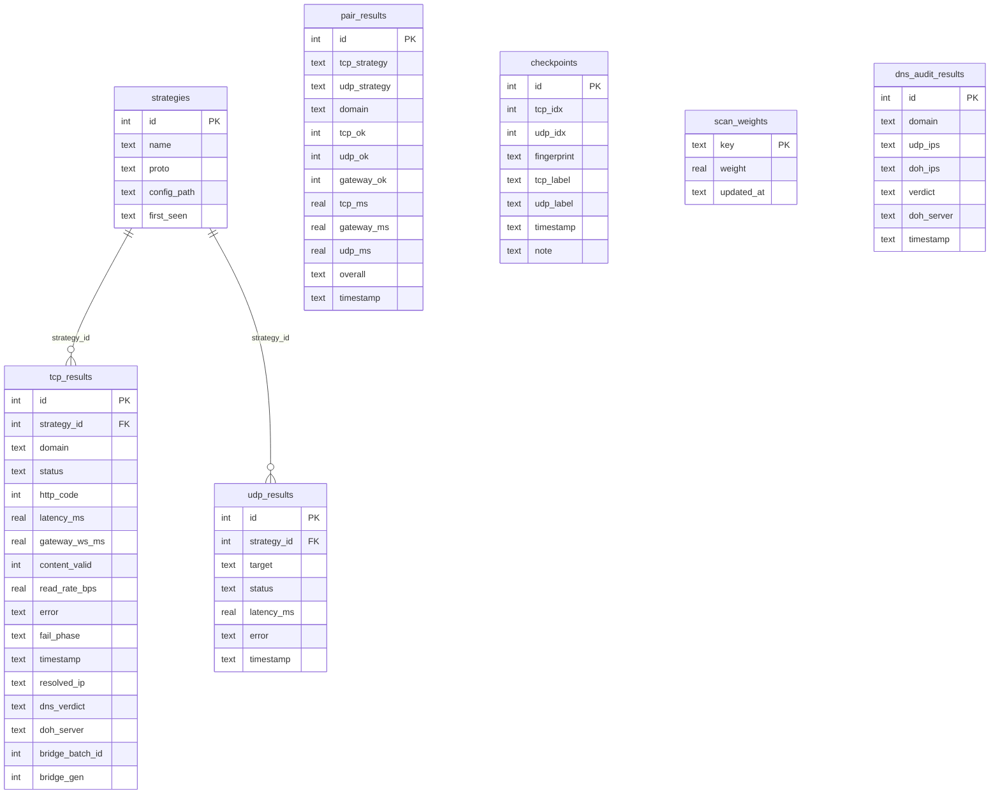

# Database — state.db

SQLite persistence for mass scans (`bs full`, `bs scan --resume`). Schema DDL in
[`engine/store/schema.py`](../src/blockchecks/engine/store/schema.py); DAO class
`SqliteRunStore` in [`engine/store/sqlite_store.py`](../src/blockchecks/engine/store/sqlite_store.py).

WAL mode; DAO connections set `busy_timeout=30000` (schema bootstrap uses 5000).

## ER diagram



## Views

| View | Purpose |
|------|---------|
| `v_working_tcp` | PASS **+ THROTTLED** rows joined with strategy name |
| `v_coverage` | strategies × domains passed, avg latency |
| `v_latest_run` | per-domain pass counts |

## Status values

### `tcp_results.status`

| Status | Meaning |
|--------|---------|
| `PASS` | HTTP OK + content validation passed |
| `FAIL` | timeout, TLS error, DPI stub, etc. |
| `THROTTLED` | read rate below threshold (window clamp) |

### `pair_results.overall`

| Value | Meaning |
|-------|---------|
| `PASS` | TCP + UDP both OK |
| `PARTIAL` | one leg OK |
| `THROTTLED` | TCP throttled, UDP OK |
| `FAIL` | both failed |

## Batch flush (B8, 1.3.1)

`log_tcp`/`log_udp` buffer rows when `batch_size > 0` (default 500). `flush()`
drains them atomically under `_flush_lock` before any await, so a concurrent
`log_tcp` from a parallel worker is never cleared away mid-commit. On failure
("database is locked" retry ×5) the drained rows are re-queued — results are
never silently lost. WAL pragmas: `synchronous=OFF`, `mmap_size`,
`cache_size=-64000`, `temp_store=MEMORY`.

## DNS audit

`--doh-server` / `--skip-dns-audit` control the UDP-vs-DoH audit written to
`dns_audit_results` (verdict: `ok`/`tampered`/`sinkhole`/…). `scan_weights`
persists adaptive-queue family/blob/trait weights between runs.

## Resume / fingerprint

`matrix_fingerprint(tcp_strategies, udp_strategies, scan_level, max_count)` returns
a 16-char SHA256 prefix. `bs pair --resume` refuses to continue if fingerprint
drifted (matrix changed).

`bs full --resume` skips `(strategy, domain)` pairs already in `tcp_results`.

## Example queries

Stress run reference: ~312k TCP jobs, ~94k PASS (Aug 2026).

```sql
-- Top domains by PASS count
SELECT domain,
       SUM(CASE WHEN status='PASS' THEN 1 ELSE 0 END) AS pass,
       COUNT(*) AS total,
       ROUND(100.0 * SUM(CASE WHEN status='PASS' THEN 1 ELSE 0 END) / COUNT(*), 1) AS pct
FROM tcp_results
GROUP BY domain
ORDER BY pass DESC
LIMIT 10;
```

```sql
-- Strategies with most domain coverage
SELECT * FROM v_coverage ORDER BY domains_passed DESC LIMIT 10;
```

```sql
-- discord.com working strategies
SELECT strategy, latency_ms FROM v_working_tcp
WHERE domain = 'discord.com'
ORDER BY latency_ms
LIMIT 20;
```

```sql
-- Zero-pass domains (candidates for denylist)
SELECT domain, COUNT(*) AS attempts
FROM tcp_results
GROUP BY domain
HAVING SUM(CASE WHEN status='PASS' THEN 1 ELSE 0 END) = 0;
```

```sql
-- Pair matrix summary
SELECT overall, COUNT(*) FROM pair_results GROUP BY overall;
```

```sql
-- Latest checkpoint
SELECT * FROM checkpoints ORDER BY id DESC LIMIT 1;
```

## CLI export

```bash
bc-nfconf --db state.db --limit 3 --out-dir output
```

Reads `v_coverage` / best strategies via `SqliteRunStore.get_best_*`.
